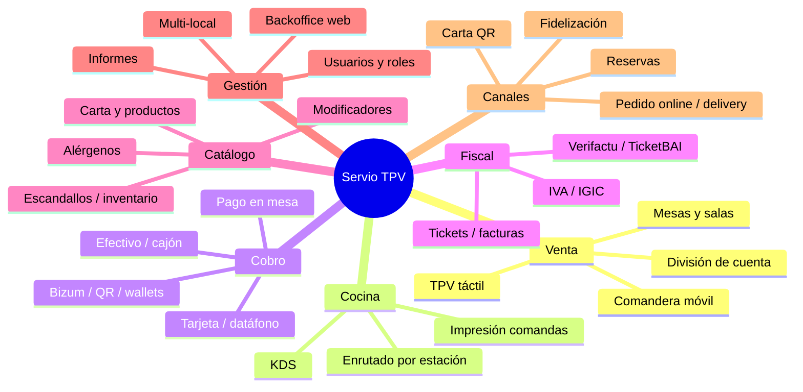

# 03 — Requisitos funcionales

> Catálogo completo de lo que hace el sistema, organizado por módulos. Cada módulo indica las funciones, prioridad (**MVP** / **v1** / **Escala**) y notas. Es la base para el backlog de desarrollo y para el diseño de la base de datos ([06](06-base-de-datos-y-sincronizacion.md)).

**Leyenda de prioridad:** 🟢 MVP (imprescindible para vender) · 🟡 v1 (versión comercial completa) · 🔵 Escala (diferenciación/crecimiento).

---

## 1. Mapa de módulos

---

## 2. Módulo: Venta y TPV

### 2.1 TPV táctil (barra / caja) 🟢
- Pantalla de venta táctil con productos por categorías, favoritos y búsqueda.
- Venta rápida (barra: «directo a cobro») y venta por mesa (restaurante).
- Aparcar/recuperar cuentas, varias cuentas abiertas simultáneas.
- Aplicar descuentos (por línea o ticket, % o importe), invitaciones, mermas.
- Anulaciones con motivo y trazabilidad (auditable, requisito Verifactu).
- Cambio de precio puntual con permiso por rol.
- Apertura/cierre de caja, arqueo, fondo de cambio, retiradas/entradas de efectivo.

### 2.2 Gestión de mesas y salas 🟢
- Editor visual de **plano de sala** (drag‑and‑drop): mesas, barra, terraza, zonas.
- Estados de mesa (libre, ocupada, pidiendo, servida, cuenta solicitada, por cobrar).
- Unir/separar mesas, mover comensales, cambiar de mesa una cuenta.
- Asignación de comensales por mesa y **gestión por asiento** (seat numbering) 🟡.
- Tiempos de mesa (cuánto lleva ocupada) y rotación 🟡.
- Asignación de camarero a mesa/zona 🟡.

### 2.3 Comandera móvil (camarero) 🟢
- App Android/iOS para tomar comandas en mesa (ver [10](10-comanderas-kds-e-impresion.md)).
- Selección de mesa → comensales → productos → modificadores → enviar a cocina.
- Funciona **offline**; la comanda se sincroniza al instante con cocina/KDS y TPV.
- Notas por plato y por comanda (sin cebolla, punto de la carne…).
- Marcar fuera de carta / 86 (agotado) en tiempo real.
- Login por **PIN rápido** del camarero.
- Llamada/aviso a cocina o a otro compañero 🟡.

### 2.4 División de cuenta 🟢
- Dividir por **partes iguales**, por **producto/línea**, por **comensal/asiento**.
- Cuentas separadas dentro de una misma mesa.
- Cobros parciales (algunos pagan, otros siguen) y propinas por cuenta 🟡.

### 2.5 Coursing (tiempos de platos) 🟡
- Agrupar comanda en **pases** (entrantes, principales, postres) y liberar pases a cocina cuando el camarero lo indique.

---

## 3. Módulo: Cocina (KDS e impresión)

### 3.1 Enrutado de comandas 🟢
- Asociar cada producto a una **estación** (barra, cocina fría, parrilla, postres).
- Al enviar la comanda, división automática: bebidas → barra, platos → su estación.
- Configurar destino: impresora de comandas y/o pantalla KDS por estación.

### 3.2 Impresión de comandas 🟢
- Impresión en impresora de cocina (impacto) y/o barra (térmica) — ver [09](09-hardware.md)/[10](10-comanderas-kds-e-impresion.md).
- Formato claro: mesa, camarero, hora, productos, modificadores, notas, pase.
- Reimpresión y aviso de fallo de impresión (con reintento en cola).

### 3.3 KDS (Kitchen Display System) 🟡
- Pantalla de cocina con comandas en tiempo real, cronómetro y colores por tiempo de espera.
- Marcar platos/comandas como «en preparación» y «listo» (toque o bump bar).
- Vista por estación y vista de pase (línea caliente).
- Aviso sonoro de nueva comanda; histórico/recuperar comanda.
- Estadísticas de tiempos de preparación 🔵.

---

## 4. Módulo: Cobro y pagos

> Detalle técnico y de pasarelas en **[08 — Pasarelas de pago](08-pasarelas-de-pago.md)**.

### 4.1 Medios de pago 🟢
- **Efectivo** con cálculo de cambio y apertura de **cajón** (pulso ESC/POS).
- **Tarjeta** vía datáfono integrado/semiintegrado (Redsys, Stripe Terminal).
- **Bizum** (vía Redsys o QR) 🟢/🟡.
- **Apple Pay / Google Pay** (contactless en datáfono o Tap to Pay) 🟡.
- Pago mixto (parte efectivo, parte tarjeta) 🟡.
- Cobro de **propina** (en datáfono o en pago QR) 🟡.

### 4.2 Pago en mesa por QR (pay‑at‑table) 🟡
- El cliente escanea un QR, ve su cuenta, divide, deja propina y paga sin app.
- Confirmación en tiempo real en el TPV (mesa marcada como cobrada).
- Beneficios: cobro de 8‑12 min → 1‑3 min, +propinas, +rotación.

### 4.3 Tap to Pay (sin hardware) 🔵
- Cobro contactless con el propio móvil del camarero (iPhone/Android), sin datáfono.

---

## 5. Módulo: Facturación y fiscalidad

> Núcleo legal del producto. Detalle en **[07 — Facturación y cumplimiento legal](07-facturacion-y-cumplimiento-legal.md)**.

### 5.1 Tickets y facturas 🟢
- **Ticket / factura simplificada** con todos los campos legales (RD 1619/2012).
- Conversión a **factura simplificada cualificada** (NIF + domicilio + cuota separada) y a **factura completa** a petición del cliente.
- Series correlativas por establecimiento/tipo.
- Múltiples tipos de IVA/IGIC en un mismo ticket; distinción **consumo en local vs. para llevar**.
- Facturas rectificativas.
- Envío de ticket/factura por **email o QR** (ticket digital, menos papel) 🟡.

### 5.2 Verifactu 🟢
- Registro de facturación de alta y de anulación con **hash encadenado (SHA‑256)**.
- **Código QR** en cada ticket + leyenda «VERI*FACTU».
- Envío a la AEAT por web service (modalidad Verifactu) o firma local (modalidad no Verifactu).
- **Registro de eventos** e inalterabilidad.
- Generación offline con envío diferido al reconectar.

### 5.3 TicketBAI 🟡
- Módulo para País Vasco (Álava/Gipuzkoa/Bizkaia + Batuz) con firma electrónica y envío foral.
- Conmutación automática Verifactu ↔ TicketBAI según el territorio del local.

### 5.4 Impuestos 🟢
- Motor de impuestos parametrizable: **IVA** (peninsular) e **IGIC** (Canarias), por tipo de producto y modo de consumo.
- Configuración por local (un grupo puede tener locales en distintos territorios).

---

## 6. Módulo: Catálogo (carta, productos, inventario)

### 6.1 Carta y productos 🟢
- Categorías, subcategorías, productos, precios, fotos.
- **Modificadores** y opciones (tamaños, extras, punto de cocción, sin/ con).
- Menús y combos, productos compuestos.
- **Tarifas múltiples** (terraza vs. barra, happy hour, festivos) 🟡.
- **Alérgenos** (los 14 obligatorios UE) por producto 🟢.
- Disponibilidad horaria (desayunos, menú del día) 🟡.

### 6.2 Inventario y escandallos 🟡
- Stock por producto/ingrediente, descuento automático al vender.
- **Escandallos** (receta → coste → margen por plato).
- Alertas de stock bajo, mermas, regularizaciones.
- Compras y proveedores 🔵.
- Multi‑almacén (cocina, barra, bodega) 🔵.

---

## 7. Módulo: Backoffice y gestión

### 7.1 Panel web de gestión 🟢
- Gestión de carta, precios, impuestos, salas, impresoras, dispositivos.
- Gestión de **usuarios y roles** (ver 7.2).
- Configuración del local (datos fiscales, series, logo en ticket).
- Acceso desde cualquier navegador (el dueño gestiona desde casa).

### 7.2 Usuarios, roles y permisos 🟢
- Roles: **admin de plataforma**, **propietario**, **encargado**, **camarero**, **cocina/KDS**.
- Permisos granulares (anular, descuento, abrir cajón, ver informes, cierre de caja).
- **PIN** por empleado para el TPV/comandera; login email+password para backoffice.
- Control horario / fichaje de empleados 🔵.

### 7.3 Informes y analítica 🟡
- Ventas por periodo, producto, categoría, camarero, sala, medio de pago.
- Ticket medio, rotación de mesas, horas punta, productos más/menos vendidos.
- Márgenes por plato (con escandallos), informe de mermas y descuentos.
- Cierre Z / X de caja, libro de IVA/IGIC, exportación a contabilidad (Sage/A3/Holded) 🟡.
- **Cuadro de mando** en tiempo real para el dueño (app/web) 🟡.
- Previsión de demanda y sugerencias con **IA** 🔵.

### 7.4 Multi‑local 🟡
- Gestión centralizada de varios locales, carta compartida o por local.
- Informes consolidados y comparativa entre locales.
- Roles a nivel de grupo y a nivel de local.

---

## 8. Módulo: Canales digitales

### 8.1 Carta digital QR 🟡
- Carta consultable por QR en mesa (con fotos, alérgenos, idiomas).
- Opcional: **pedido desde la mesa** por el cliente (Scan & Order) 🔵.

### 8.2 Pedido online y delivery 🟡
- Tienda/web de pedidos propia (recogida y entrega) **sin comisión** del TPV.
- Integración con agregadores (**Glovo, Uber Eats, Just Eat**) vía **Deliverect** 🟡.
- Las comandas online entran directas a cocina/KDS como una mesa más.

### 8.3 Reservas 🔵
- Gestión de reservas y lista de espera; integración con TheFork/CoverManager 🔵.

### 8.4 Fidelización 🔵
- Tarjeta/monedero de cliente, puntos, promociones, gift cards.
- Base de datos de clientes (con consentimiento RGPD — ver [12](12-seguridad-y-rgpd.md)).

---

## 9. Requisitos no funcionales (transversales)

| Requisito | Objetivo |
|-----------|----------|
| **Disponibilidad offline** | 100 % de funciones de venta/cobro/impresión sin internet; sync al reconectar. Ver [04](04-arquitectura-tecnica.md)/[06](06-base-de-datos-y-sincronizacion.md). |
| **Rendimiento** | Acción de comanda < 200 ms; arranque del TPV < 5 s; soportar hora punta sin lag. |
| **Fiabilidad** | Cero pérdida de tickets; idempotencia en sync; reintentos de impresión/cobro. |
| **Seguridad** | Cifrado, RLS por tenant, PCI (no almacenar PAN), RGPD. Ver [12](12-seguridad-y-rgpd.md). |
| **Escalabilidad** | Multi‑tenant; de 1 a miles de locales sin reescritura. |
| **Usabilidad** | Curva de aprendizaje < 1 hora para un camarero; alta autoservicio del local. |
| **Internacionalización** | Multi‑idioma y multi‑territorio fiscal desde el diseño. |
| **Accesibilidad** | Contraste y tamaño táctil adecuados a entorno de barra (manos ocupadas, prisa). |
| **Auditoría** | Trazabilidad de toda acción sensible (anulaciones, descuentos, accesos) — exigible por Verifactu. |
| **Actualizaciones** | OTA en móvil (Expo), auto‑update en escritorio; sin parar el servicio. |

---

## 10. Matriz de funciones por plataforma

| Función | Web | Windows (Tauri) | Android/iOS (comandera) | KDS |
|---------|-----|-----------------|-------------------------|-----|
| Backoffice / gestión | ✅ | ⚙️ (acceso) | ❌ | ❌ |
| TPV / cobro | ✅ (respaldo) | ✅ (principal) | ✅ (cobro en mesa) | ❌ |
| Tomar comanda | ✅ | ✅ | ✅ (principal) | ❌ |
| Plano de mesas | ✅ | ✅ | ✅ | ❌ |
| Impresión local (ESC/POS) | ⚙️ (ePOS red) | ✅ (USB/serie/red) | ✅ (Bluetooth/red) | — |
| Cajón / datáfono | ❌ | ✅ | ⚙️ (datáfono móvil) | ❌ |
| Ver/gestionar comandas cocina | ✅ | ✅ | ⚙️ | ✅ (principal) |
| Informes | ✅ (completo) | ✅ (básico) | ⚙️ (resumen) | ❌ |

✅ soportado · ⚙️ parcial/según caso · ❌ no aplica

---

## 11. Prioridización resumida del MVP

**El MVP vendible (🟢) incluye:** TPV táctil + mesas + comandera (1 plataforma) + división básica de cuenta + enrutado e impresión de comandas + cobro (efectivo+tarjeta) + **tickets/facturas con Verifactu** + IVA/IGIC + carta/productos/modificadores/alérgenos + backoffice básico + usuarios/roles + **offline + sync**.

Todo lo 🟡 y 🔵 entra en v1 y fases posteriores según el **[roadmap](13-roadmap-mvp-y-equipo.md)**.
