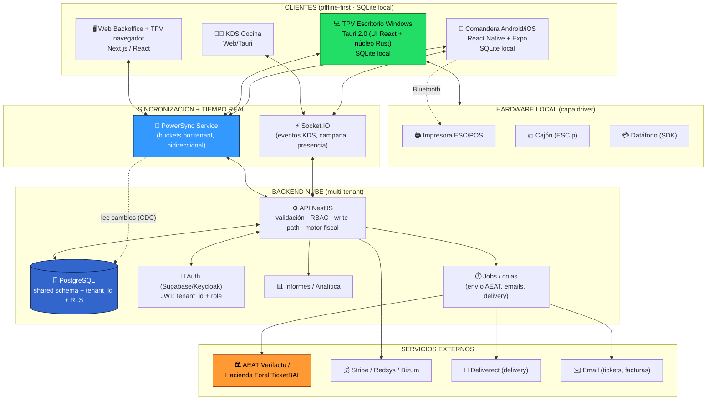
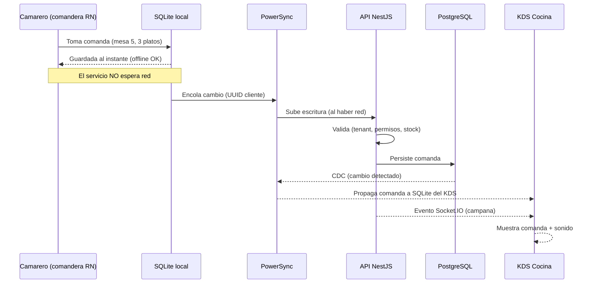
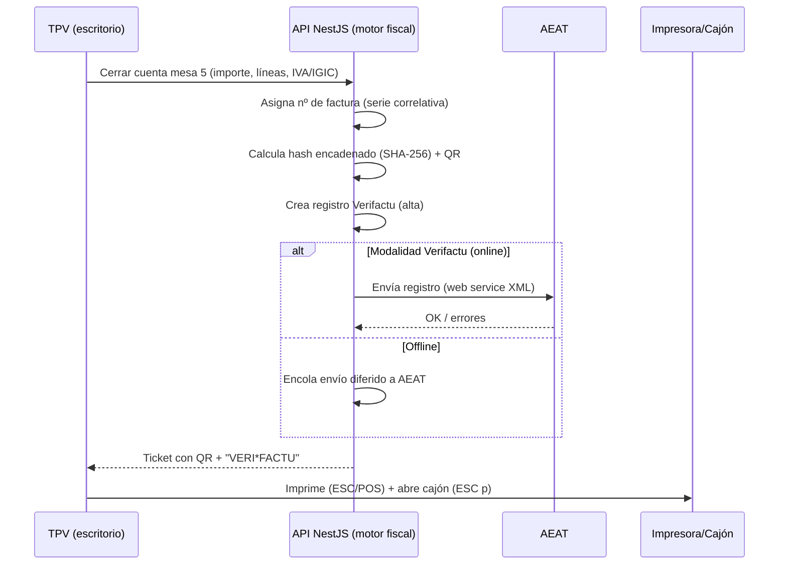
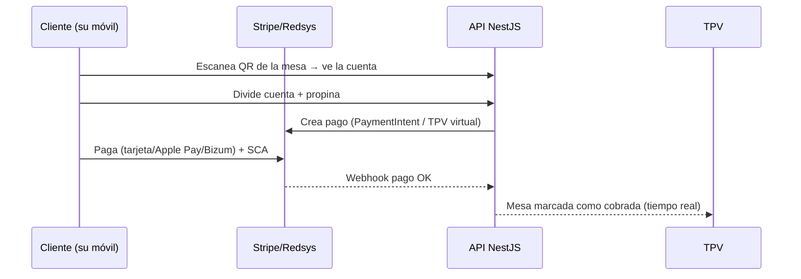

# 04 — Arquitectura técnica

> Cómo encajan todas las piezas: aplicaciones cliente, sincronización offline‑first, backend multi‑tenant, tiempo real y servicios externos. Las elecciones concretas de tecnología se justifican en **[05 — Stack tecnológico](05-stack-tecnologico.md)**; el modelo de datos y la sincronización en detalle, en **[06](06-base-de-datos-y-sincronizacion.md)**.

---

## 1. Principios de arquitectura

1. **Local‑first.** La fuente de verdad *operativa* de cada dispositivo es una base de datos **local (SQLite)**. La app nunca bloquea esperando la red. La nube (PostgreSQL) es la fuente de verdad *canónica*.
2. **Un solo lenguaje, un solo equipo.** TypeScript de extremo a extremo (cliente y servidor) para maximizar reutilización y velocidad de entrega.
3. **El camino de escritura pasa por el backend.** Toda escritura sincronizada se valida en el backend (autorización por tenant, lógica fiscal, numeración legal). Nada «sucio» entra en Postgres.
4. **Fiscalidad en el núcleo.** La generación de registros Verifactu/TicketBAI ocurre en un punto controlado y auditable (backend), no como parche.
5. **Hardware aislado.** El acceso a impresora/cajón/datáfono vive en un módulo «driver» reutilizable (Rust en escritorio, SDK nativo en móvil).
6. **Multi‑tenant por diseño.** Un `tenant_id` (restaurante/grupo) atraviesa datos, sincronización, autenticación y permisos.

---

## 2. Vista de alto nivel

---

## 3. Capas de la arquitectura

### 3.1 Capa de clientes
| Cliente | Tecnología | Rol | Offline |
|---------|-----------|-----|---------|
| **Web** | Next.js (React) | Backoffice (gestión, informes) + TPV de respaldo en navegador | Limitado (PWA opcional) |
| **Escritorio Windows** | Tauri 2.0 (React + Rust) | **TPV principal de barra**: cobro, impresión, cajón, datáfono | **Total** (SQLite local) |
| **Móvil Android/iOS** | React Native + Expo | **Comandera** del camarero, cobro en mesa | **Total** (SQLite local) |
| **KDS** | Web o Tauri | Pantalla de cocina | Local en red |

> **Decisión clave:** el TPV «serio» es la **app de escritorio**, no el navegador. Una pestaña de navegador es frágil (cierres accidentales, permisos de hardware limitados, offline endeble). El TPV web es comodidad/respaldo.

### 3.2 Capa de sincronización (el corazón)
- **PowerSync** mantiene cada SQLite local en sync con PostgreSQL de forma **bidireccional**, con **buckets por tenant** (cada dispositivo solo baja los datos de su restaurante) y **cola de escritura persistente** (lo hecho offline se sube al reconectar).
- Las **escrituras suben a través del API NestJS**, donde se aplica validación, RBAC y la lógica fiscal.
- Detalle de reglas de sync, conflictos e idempotencia en **[06](06-base-de-datos-y-sincronizacion.md)**.

### 3.3 Capa de tiempo real
Se distinguen **dos tipos**:
1. **Sincronización de datos** (la comanda persiste y aparece en otro dispositivo) → la cubre **PowerSync**.
2. **Eventos efímeros** (campana en cocina, «camarero llamado», presencia de dispositivos) → **Socket.IO** sobre NestJS (rooms por local/tenant, escalado con adapter Redis).

### 3.4 Capa de backend
- **API NestJS** (modular, DI): endpoints REST/tRPC, *write path* de PowerSync, motor fiscal, RBAC, webhooks de pago/delivery.
- **Jobs/colas** (BullMQ/Redis): envío a AEAT, emails, sincronización con Deliverect, reintentos.
- **PostgreSQL**: shared schema + `tenant_id` + **RLS** (Row‑Level Security).
- **Auth**: Supabase Auth al arrancar → Keycloak en escala. El **JWT lleva `tenant_id` + rol**, que alimenta RLS, buckets de PowerSync y guards del API.

### 3.5 Capa de hardware (driver)
- **Escritorio (Tauri/Rust):** plugins serial/ESC/POS (`tauri-plugin-serialport`, `tauri-plugin-esc-pos`/thermal); Rust enlaza la DLL/SDK del datáfono (Redsys TPV‑PC, Stripe Terminal).
- **Móvil (RN):** SDK del fabricante (Epson/Star) o impresora Bluetooth; SDK del datáfono (Stripe Terminal).
- **Aislado** en un módulo común para no acoplar la lógica de negocio al hardware. Ver [09](09-hardware.md)/[10](10-comanderas-kds-e-impresion.md).

### 3.6 Servicios externos
AEAT (Verifactu) / Haciendas forales (TicketBAI), pasarelas de pago (Stripe/Redsys/Bizum — ver [08](08-pasarelas-de-pago.md)), Deliverect (delivery), email transaccional.

---

## 4. Flujos clave

### 4.1 Flujo de una comanda (offline → cocina)

### 4.2 Flujo de cobro + factura Verifactu

> **Nota offline:** la numeración fiscal y el hash los arbitra el **servidor**. Para operar 100 % offline se usan **rangos de numeración pre‑asignados por dispositivo** o asignación al sincronizar; el registro se crea localmente y el envío a AEAT se difiere. Ver [06](06-base-de-datos-y-sincronizacion.md) §conflictos y [07](07-facturacion-y-cumplimiento-legal.md).

### 4.3 Flujo de pago en mesa por QR

---

## 5. Estrategia offline‑first (resumen accionable)

> Es el riesgo nº1 del proyecto y nuestro diferenciador nº1. Detalle en **[06](06-base-de-datos-y-sincronizacion.md)**.

1. **SQLite local = verdad operativa** en escritorio y móvil; la app nunca espera red.
2. **Dominio modelado como inserciones inmutables/eventos** (líneas de comanda, pagos, aperturas de mesa) → elimina ~90 % de conflictos.
3. **PowerSync** para sync bidireccional con cola persistente; escrituras **a través del backend**.
4. **Conflictos:** *last‑write‑wins* por timestamp de servidor en campos mutables (estado de mesa); **numeración fiscal y stock** los arbitra el servidor (o rangos pre‑asignados).
5. **Idempotencia:** cada operación lleva un **UUID de cliente**; los reintentos no duplican.
6. **Buckets por tenant** alineados con el `tenant_id` del JWT.
7. **Degradación de hardware:** impresión/cajón/datáfono funcionan en local; reintentos de impresión en cola si la impresora falla.
8. **Pago con tarjeta:** el datáfono **sí** necesita red para autorizar → mitigación con **datáfono con 4G propio** y router con **failover 4G/5G** (ver [09](09-hardware.md)).

---

## 6. Multi‑tenant

- **Modelo:** *shared schema* + columna **`tenant_id`** en todas las tablas + **RLS** en PostgreSQL (defensa en la BD: una query con bug no filtra datos de otro restaurante).
- **Aislamiento de sync:** buckets de PowerSync por `tenant_id`.
- **Aislamiento de auth:** el JWT porta `tenant_id` y `role`.
- **Rendimiento:** `tenant_id` debe ser la **primera columna de los índices compuestos** (con RLS, si no, las consultas pueden degradarse mucho).
- Modelos alternativos (schema por tenant, BD por tenant) reservados a clientes enterprise. Detalle en [06](06-base-de-datos-y-sincronizacion.md).

---

## 7. Despliegue e infraestructura

| Fase | Infraestructura |
|------|-----------------|
| **Arranque / piloto** | **Supabase** (Postgres + Auth) + **Fly.io / Render** (API NestJS en contenedor) + **PowerSync Cloud** + Redis gestionado. Coste ~60‑120 €/mes. |
| **Escala** | **AWS** (ECS/Fargate + RDS Postgres Multi‑AZ + ElastiCache Redis) o equivalente, sin reescritura (misma arquitectura de contenedores + Postgres). |

- **CI/CD:** GitHub Actions + caché de Turborepo (solo construye/testea lo afectado).
- **Observabilidad:** logs centralizados, métricas, alertas (Sentry + Grafana/Datadog según fase).
- **Backups:** Postgres con PITR; export periódico; los SQLite locales son recreables desde la nube.

> Justificación detallada de cada elección (Tauri vs Electron, NestJS vs Go, PowerSync vs ElectricSQL, etc.) en **[05 — Stack tecnológico](05-stack-tecnologico.md)**.
