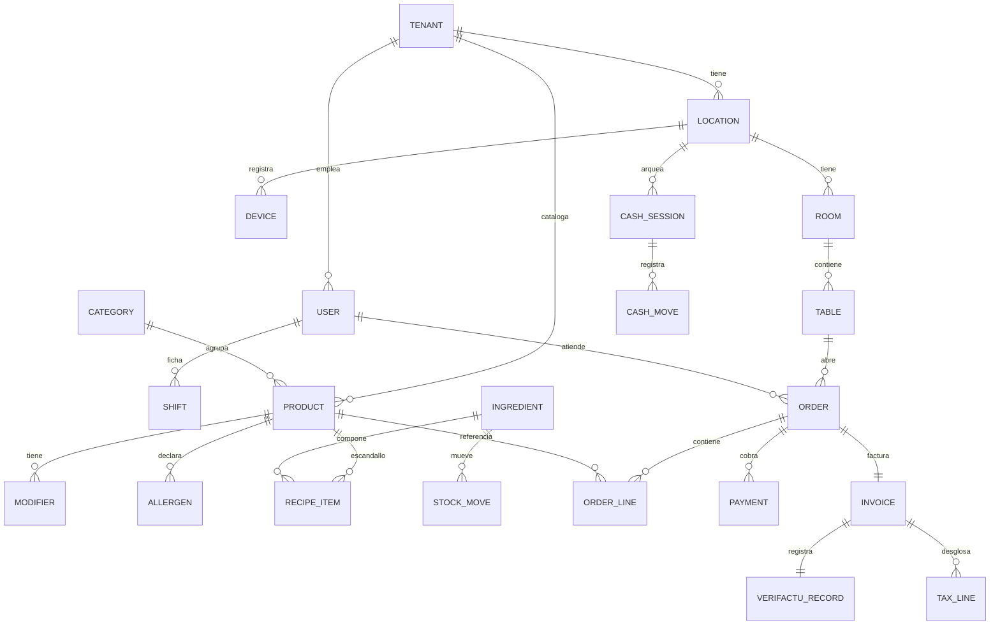
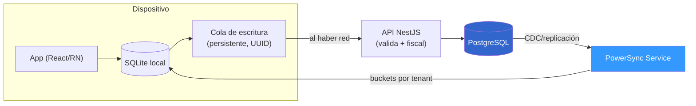

# 06 — Base de datos y sincronización

> El modelo de datos, la estrategia multi‑tenant y —lo más difícil de un TPV— la **sincronización offline‑first**. Si algo se diseña mal aquí, el proyecto fracasa. Complementa la arquitectura ([04](04-arquitectura-tecnica.md)) y el stack ([05](05-stack-tecnologico.md)).

---

## 1. Motor y por qué PostgreSQL

**PostgreSQL** es la fuente de verdad canónica. Razones: **Row‑Level Security (RLS)** nativa para multi‑tenant, **JSONB** para datos flexibles (modificadores, configuración), **logical replication** (base de PowerSync), transacciones sólidas y ecosistema maduro. En cada cliente (escritorio y móvil) hay una **SQLite local** gestionada por PowerSync.

---

## 2. Estrategia multi‑tenant

**Elección: shared schema + columna `tenant_id` + RLS.**

| Modelo | Aislamiento | Operativa | Veredicto |
|--------|-------------|-----------|-----------|
| **`tenant_id` + RLS** | Bueno (defensa en la BD) | **Simple y barato**, ideal para muchos locales | ✅ **Elegido** |
| Schema por tenant | Fuerte | Postgres no escala a miles de schemas; migraciones ×N | Solo decenas de clientes premium |
| BD por tenant | Máximo | Operativa pesada, cara | Enterprise con exigencia legal |

**Reglas de oro:**
- **`tenant_id` en todas las tablas** de negocio (clave de partición lógica).
- **`tenant_id` = primera columna de los índices compuestos** (con RLS, si no, las consultas pueden ir 100× más lentas).
- **RLS «seguro por defecto»**: sin contexto de tenant, las políticas devuelven **cero filas**.
- El **JWT** del usuario porta `tenant_id` (y `role`); se fija como variable de sesión (`SET app.tenant_id`) para que RLS filtre.
- Un **grupo/cadena** es un tenant con varios **locales** (`location_id`); los roles pueden ser a nivel de grupo o de local.

```sql
-- Ejemplo de política RLS (ilustrativo)
ALTER TABLE orders ENABLE ROW LEVEL SECURITY;
CREATE POLICY tenant_isolation ON orders
  USING (tenant_id = current_setting('app.tenant_id')::uuid);

-- Índice con tenant_id primero
CREATE INDEX idx_orders_tenant_location_status
  ON orders (tenant_id, location_id, status);
```

---

## 3. Modelo de datos (entidades principales)

> Esquema conceptual de alto nivel. El DDL detallado se define en la fase de arranque técnico. Todas las tablas llevan `tenant_id`, `id` (UUID), `created_at`, `updated_at`, y campos de sync (`client_id`, `deleted_at`).



### 3.1 Tablas por dominio

**Tenancy y organización**
| Tabla | Campos clave |
|-------|--------------|
| `tenant` | id, nombre, plan, datos de facturación del SaaS |
| `location` | id, tenant_id, nombre, dirección, **territorio fiscal** (común/IGIC/foral), datos fiscales, series |
| `device` | id, location_id, tipo (TPV/comandera/KDS), **rango de numeración asignado**, última sync |
| `user` | id, tenant_id, nombre, email, **pin_hash**, rol |
| `role`/`permission` | matriz de permisos granulares |
| `shift` | fichajes (entrada/salida) |

**Catálogo**
| Tabla | Campos clave |
|-------|--------------|
| `category` | id, tenant_id, nombre, orden |
| `product` | id, tenant_id, nombre, precio, **tipo_impositivo**, categoría, foto, disponible |
| `modifier_group` / `modifier` | extras, opciones, suplementos |
| `allergen` | catálogo de los 14 + relación con producto |
| `price_list` | tarifas (terraza, happy hour) |
| `ingredient` / `recipe_item` | inventario y escandallos |
| `stock_move` | movimientos de stock (entrada/salida/merma) |

**Sala y venta**
| Tabla | Campos clave |
|-------|--------------|
| `room` / `table` | salas y mesas (posición x/y para el plano, estado) |
| `order` | id, tenant_id, location_id, table_id, user_id, estado, total, **client_id (UUID)** |
| `order_line` | order_id, product_id, cantidad, precio, modificadores (JSONB), notas, **estación/pase** |
| `order_event` | eventos inmutables (creada, enviada a cocina, servida, anulada) — *event log* |

**Cobro y fiscalidad**
| Tabla | Campos clave |
|-------|--------------|
| `payment` | order_id, método (efectivo/tarjeta/bizum/qr), importe, propina, ref. pasarela |
| `invoice` | id, **serie + número correlativo**, tipo (F1/F2/R…), order_id, totales |
| `tax_line` | invoice_id, tipo (IVA/IGIC), %, base, cuota |
| `verifactu_record` | invoice_id, **hash**, **hash_anterior**, qr_url, estado_envío_aeat, timestamp |
| `ticketbai_record` | (módulo foral) firma, encadenamiento, estado envío |
| `cash_session` / `cash_move` | apertura/cierre de caja, arqueos, entradas/salidas |

**Canales**
| Tabla | Campos clave |
|-------|--------------|
| `customer` | clientes (fidelización, con consentimiento RGPD) |
| `reservation` | reservas |
| `online_order` | pedidos web/delivery (origen: propio/Glovo/UberEats…) |

---

## 4. Sincronización offline‑first (el corazón del TPV)

### 4.1 Patrón base
- **SQLite local = fuente de verdad operativa** en cada dispositivo. La app **nunca** bloquea esperando red.
- **PostgreSQL = fuente de verdad canónica.**
- **PowerSync** reconcilia ambos de forma **bidireccional**: baja los datos del tenant a la SQLite local (buckets) y sube las escrituras locales encoladas.
- **Las escrituras suben a través del API NestJS** → validación, RBAC por `tenant_id`, **lógica fiscal y numeración**. Nada entra «crudo» en Postgres.



### 4.2 Modelar el dominio para minimizar conflictos
La mayoría de operaciones de hostelería son **inserciones** (nuevas líneas de comanda, nuevos pagos) → **no generan conflicto**. Modelamos el dominio como **eventos/inserciones inmutables** (cercano a *event sourcing*): esto elimina ~90 % de los conflictos de partida.

### 4.3 Resolución de conflictos (caso por caso)

| Caso | Tipo de dato | Estrategia |
|------|--------------|-----------|
| Nuevas líneas de comanda, pagos, eventos | **Insert inmutable** | Sin conflicto (se acumulan) |
| Estado de mesa (libre/ocupada) | Campo mutable compartido | **Last‑write‑wins** por timestamp **de servidor** |
| **Numeración fiscal de facturas** | Crítico, único | **La asigna el servidor**; offline → **rangos pre‑asignados por dispositivo** |
| **Stock de ingredientes** | Cantidad compartida | Reconciliar con **decrementos relativos** (no valores absolutos) |
| Edición de carta/precios (backoffice) | Mutable | LWW por timestamp; normalmente se edita online |

### 4.4 Numeración fiscal offline (punto delicado)
La ley exige numeración **correlativa y sin huecos** por serie. Para operar offline sin duplicar números:
- Cada `device` recibe un **rango/serie pre‑asignado** (p. ej. serie por dispositivo, o bloques de números reservados) al registrarse.
- El registro Verifactu (hash encadenado) se genera **localmente** con la cadena del dispositivo; el **envío a la AEAT se difiere** y se hace al reconectar (modo Verifactu) o se firma localmente (modo no Verifactu).
- El backend valida la continuidad al sincronizar y detecta anomalías (registro de eventos).
- Detalle legal en **[07 — Facturación y cumplimiento legal](07-facturacion-y-cumplimiento-legal.md)**.

### 4.5 Idempotencia
- Cada operación local lleva un **`client_id` (UUID)** generado en el dispositivo.
- El backend usa ese UUID como clave de idempotencia → los **reintentos de subida no duplican** comandas, pagos ni facturas.

### 4.6 Buckets de sincronización
- PowerSync define **«sync rules»** que agrupan los datos en **buckets por `tenant_id`** (y, si conviene, por `location_id`).
- Cada dispositivo **solo descarga** los datos de su restaurante/local → menos datos locales, más privacidad, mejor rendimiento.
- Alineado con el `tenant_id` del JWT (mismo claim que activa la RLS).

---

## 5. Consideraciones de rendimiento

- **Índices con `tenant_id` primero** (ver §2).
- Particionado por `tenant_id`/fecha en tablas grandes (`order`, `order_line`, `invoice`) cuando crezca el volumen.
- **Datos calientes vs. fríos:** la SQLite local solo necesita la operativa reciente (carta, mesas, comandas abiertas, últimos cierres); el histórico vive en la nube y se consulta bajo demanda.
- Materialized views / tablas de agregación para informes (no calcular sobre la operativa en hora punta).
- PowerSync soporta millones de filas locales, pero conviene **limitar el bucket** a lo necesario (p. ej. últimas N semanas de tickets en el dispositivo).

---

## 6. Backups, retención y migraciones

- **Backups Postgres** con PITR (point‑in‑time recovery); export periódico cifrado.
- Los **SQLite locales son recreables** desde la nube (no son la copia de seguridad).
- **Retención fiscal:** registros de facturación y Verifactu **≥ 6 años** (criterio mercantil; ver [07](07-facturacion-y-cumplimiento-legal.md)).
- **Migraciones de esquema:** versionadas (Prisma Migrate), compatibles con sync (cambios aditivos preferidos; PowerSync re‑sincroniza el esquema del cliente).
- **RGPD:** políticas de bloqueo/borrado de datos personales tras el plazo legal (ver [12](12-seguridad-y-rgpd.md)).

---

## 7. Resumen de decisiones

| Decisión | Elección |
|----------|----------|
| Motor canónico | **PostgreSQL** |
| BD local cliente | **SQLite** (vía PowerSync) |
| Multi‑tenant | **shared schema + `tenant_id` + RLS** |
| Sync | **PowerSync** bidireccional, escrituras por backend |
| Conflictos | Inserciones inmutables + LWW servidor + numeración fiscal arbitrada por servidor |
| Idempotencia | **`client_id` UUID** por operación |
| Aislamiento | Buckets por tenant + RLS, ambos desde el JWT |

> **Regla nº1:** no construir el sync a mano. PowerSync (o ElectricSQL) ahorra meses y evita el riesgo principal del proyecto.
