# 13 — Roadmap, MVP y equipo

> El plan de ejecución: qué construir primero, en qué orden, con qué equipo y a qué coste. Convierte los requisitos ([03](03-requisitos-funcionales.md)) y la arquitectura ([04](04-arquitectura-tecnica.md)) en fases entregables.

---

## 1. Filosofía de ejecución

1. **El MVP debe ser vendible y legal**, no una demo. Un TPV que no cobra, no imprime o no cumple Verifactu no sirve.
2. **Resolver lo difícil pronto:** offline‑first y fiscalidad **desde el día 1** (readaptarlos después es carísimo).
3. **Una plataforma cliente primero** (escritorio Windows = TPV de barra), luego comandera, luego el resto.
4. **Validar con un piloto real** antes de escalar (5‑10 locales del entorno La Palma/Granada).
5. **No construir el motor de sync a mano** (PowerSync) ni la pasarela (Stripe) — comprar lo que es riesgo puro.

---

## 2. Fases del roadmap

```mermaid
gantt
    title Roadmap orientativo (meses)
    dateFormat X
    axisFormat %s
    section Fase 0 Descubrimiento
    Setup, diseño, validación legal      :0, 1
    section Fase 1 MVP
    Backend + sync + multi-tenant        :1, 3
    TPV escritorio (cobro/impresion/offline) :2, 5
    Verifactu básico + IVA/IGIC          :2, 5
    Comandera v1                          :4, 6
    Piloto 5-10 locales                   :5, 7
    section Fase 2 v1 comercial
    KDS + informes + carta completa       :6, 9
    TicketBAI + datáfono real             :7, 10
    Apps móviles pulidas iOS/Android      :7, 11
    section Fase 3 Escala
    Multi-local + delivery + IA + AWS     :11, 16
```

### Fase 0 — Descubrimiento y setup (≈1 mes)
- Decisión de **nombre/marca**, dominios, alta legal.
- Setup del **monorepo** (Turborepo + pnpm), CI/CD, entornos.
- **Validación fiscal** con asesor: confirmar XSD Verifactu, casos IGIC, declaración responsable.
- Diseño UX de los flujos críticos (venta, cobro, comanda).
- Selección de proveedores (Supabase, PowerSync, Stripe sandbox).

### Fase 1 — MVP vendible (≈4‑6 meses)
**Objetivo:** un local real puede operar todo el servicio con nuestro TPV, legalmente y sin internet.

| Bloque | Entregable |
|--------|-----------|
| Backend | NestJS + PostgreSQL multi‑tenant (RLS) + Auth (Supabase) + PowerSync |
| Offline | SQLite local + sync bidireccional + idempotencia |
| **TPV escritorio (Tauri)** | Venta, mesas, cobro (efectivo+tarjeta), **impresión ESC/POS + cajón**, apertura/cierre de caja |
| **Fiscal** | **Verifactu** (hash, QR, leyenda, envío AEAT, registro de eventos) + **IVA/IGIC** + tickets/facturas |
| Comandera v1 | App RN básica: comanda offline, sync, envío a cocina |
| Catálogo | Carta, productos, modificadores, alérgenos |
| Backoffice | Gestión básica, usuarios/roles (PIN), configuración del local |
| **Piloto** | 5‑10 locales funcionando 1 mes sin parar servicio |

**Criterio de éxito MVP:** > 99,9 % de tickets conciliados; cero caídas de caja por falta de internet; Verifactu aceptado por AEAT en pruebas; un camarero aprende a usarlo en < 1 h.

### Fase 2 — v1 comercial (≈+3‑5 meses)
| Bloque | Entregable |
|--------|-----------|
| Cocina | **KDS** completo + enrutado por estación + impresión de cocina (impacto) |
| Informes | Ventas, ticket medio, cierres Z/X, libro IVA/IGIC, export contabilidad |
| Carta avanzada | Tarifas múltiples, menús/combos, disponibilidad horaria |
| División de cuenta | Por ítem/asiento/partes, cobros parciales, propinas |
| **Fiscal** | Módulo **TicketBAI** (País Vasco), factura cualificada/completa, rectificativas |
| Pagos | **Datáfono real** (Stripe Terminal + Redsys TPV‑PC), Bizum, pago QR en mesa |
| Móvil | Apps iOS/Android **pulidas** (stores), OTA updates |
| Inventario | Escandallos, stock, mermas |

### Fase 3 — Escala y diferenciación (continuo)
- **Multi‑local** consolidado (cadenas), roles de grupo, SSO.
- **Delivery** (Deliverect: Glovo/Uber Eats/Just Eat) + pedido online propio.
- **Reservas** (integración TheFork/CoverManager) y **fidelización**.
- **Analítica / IA** (previsión de demanda, optimización de carta, detección de mermas).
- **Factura electrónica B2B** (RD 238/2026) cuando se publique la Orden.
- **Internacionalización** (Francia NF525, Alemania KassenSichV).
- Migración de infraestructura a **AWS** (ECS/Fargate + RDS Multi‑AZ).

---

## 3. Equipo

### 3.1 Equipo por fase

| Fase | Equipo mínimo | Perfiles |
|------|---------------|----------|
| **MVP** | 2‑3 personas | 1 **senior full‑stack TS** (lidera) + 1 **mid full‑stack** + apoyo puntual **hardware** y **asesor fiscal** |
| **v1** | 3‑5 personas | +1 dev móvil/desktop, +1 backend, +QA |
| **Escala** | 6+ | +DevOps/SRE, +soporte, +producto/diseño, +comercial |

> El **stack unificado TypeScript** permite que un equipo pequeño cubra las 4 plataformas — es la mayor ventaja de la elección de stack ([05](05-stack-tecnologico.md)).

### 3.2 Competencias críticas (no pueden faltar)
- **Integración de hardware** (ESC/POS, datáfono): donde se pierde tiempo imprevisto.
- **Cumplimiento fiscal** (Verifactu/TicketBAI): asesoría especializada + un dev que lo domine.
- **Offline/sync**: entender bien PowerSync y el modelado de conflictos.

---

## 4. Presupuesto orientativo

> Estimaciones de trabajo, no presupuesto cerrado. Variarán según salarios, ubicación y si es equipo interno o externo.

### 4.1 Coste de desarrollo (MVP)
- Equipo de 2‑3 personas durante 4‑6 meses.
- Rango orientativo (España, mezcla de internos/freelance): **~80.000‑180.000 €** hasta MVP, según seniority y velocidad.

### 4.2 Coste de infraestructura (operación)
| Fase | Coste mensual |
|------|---------------|
| Arranque/piloto | **~60‑120 €/mes** (Supabase Pro + Fly.io/Render + PowerSync + Redis) |
| Escala | Variable (AWS) según nº de locales |

### 4.3 Costes adicionales
- Asesoría fiscal/legal (Verifactu, declaración responsable, DPA RGPD).
- Cuentas de desarrollador (Apple 99 $/año, Google 25 $ único).
- Certificado electrónico, dominios, marca.
- Hardware de pruebas (impresoras, datáfono, Sunmi) — ~1.000‑2.000 €.

---

## 5. Riesgos del proyecto (ordenados por impacto)

| # | Riesgo | Mitigación |
|---|--------|-----------|
| 1 | **Sincronización offline mal hecha** | Usar **PowerSync** (probado para POS), no construir a mano; modelar dominio como eventos. Ver [06](06-base-de-datos-y-sincronizacion.md) |
| 2 | **Cumplimiento fiscal incorrecto** | Motor fiscal en backend desde día 1; asesoría; reconfirmar XSD AEAT. Ver [07](07-facturacion-y-cumplimiento-legal.md) |
| 3 | **Integración del datáfono** | Empezar con **Stripe Terminal** (API moderna); Redsys después. Ver [08](08-pasarelas-de-pago.md) |
| 4 | **Impresión ESC/POS en hardware heterogéneo** | Módulo de hardware aislado; probar en dispositivos reales pronto. Ver [10](10-comanderas-kds-e-impresion.md) |
| 5 | **Alcance grande, equipo pequeño** | MVP enfocado; stack unificado; comprar lo que es riesgo (sync/pagos) |
| 6 | **Mercado saturado** | Diferenciación clara (offline+compliance+transparencia) + nicho inicial (IGIC) |

---

## 6. Hitos y criterios de salida (gates)

| Hito | Criterio para pasar de fase |
|------|------------------------------|
| **Fin Fase 0** | Stack montado, CI/CD, validación fiscal hecha, diseño de flujos críticos |
| **Fin MVP** | Piloto operando 1 mes sin incidencias de caja; Verifactu OK en pruebas AEAT |
| **Fin v1** | KDS + datáfono real + apps en stores + TicketBAI; primeros clientes de pago |
| **Escala** | Churn < 5 %, LTV/CAC > 3, multi‑local funcionando |

---

## 7. Primeros pasos accionables (semana 1‑2)

1. **Decidir nombre y registrar** dominio + marca.
2. **Crear el monorepo** Turborepo (apps/web, apps/desktop, apps/mobile, apps/api; packages/core, ui, hardware).
3. **Provisionar** Supabase (Postgres+Auth), cuenta Stripe (sandbox), PowerSync (trial).
4. **Esqueleto del paquete `core`**: tipos de dominio (Order, Product, Invoice), cálculo de IVA/IGIC, máquina de estados de comanda.
5. **Prueba de concepto de impresión ESC/POS** desde Tauri (Rust) a una Epson real + apertura de cajón.
6. **Prueba de concepto Verifactu**: generar hash encadenado + QR + validar contra el entorno de pruebas de la AEAT (`prewww2.aeat.es`).
7. **Reunión con asesor fiscal** para la **declaración responsable** y casos IGIC.
8. **Captar 3‑5 locales** del entorno para el piloto (compromiso de prueba).

---

## 8. Resumen

| Aspecto | Decisión |
|---------|----------|
| **MVP** | TPV escritorio (cobro/impresión/offline) + comandera + **Verifactu/IGIC** + backoffice básico. 4‑6 meses. |
| **Orden** | Lo difícil primero (offline + fiscal); una plataforma primero (Windows). |
| **Equipo** | 2‑3 (MVP) → 3‑5 (v1) → 6+ (escala), apoyado en stack unificado TS. |
| **Coste** | ~80‑180 k€ a MVP + ~60‑120 €/mes infra. |
| **Validación** | Piloto 5‑10 locales en La Palma/Granada antes de escalar. |
| **Timing comercial** | Aprovechar la **ola Verifactu 2026‑2027**. |

> Con esto cierra el dossier. Punto de entrada: **[README.md](README.md)**. Siguiente paso real: Fase 0 (semana 1‑2 arriba).
