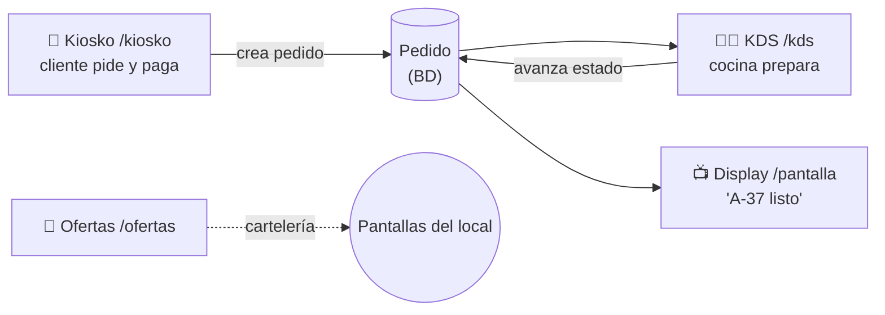

# 14 — Pantallas: kiosko, KDS, display de cliente y ofertas

> Las "superficies" de cara al cliente y a cocina, estilo fast-food (McDonald's/BK): **autopedido en kiosko**, **pantalla de cocina (KDS)**, **display del estado del pedido** y **cartelería de ofertas**. Incluye el modelo legal de operaciones (qué se factura y qué no). Complementa [03 (requisitos)](03-requisitos-funcionales.md), [10 (KDS/impresión)](10-comanderas-kds-e-impresion.md) y [07 (fiscalidad)](07-facturacion-y-cumplimiento-legal.md).

---

## 1. Inventario de pantallas

| Pantalla | Ruta (web) | Para quién | Estado |
|----------|-----------|-----------|--------|
| **TPV** | `/tpv` | Empleado (barra) | ✅ Demo funcional |
| **Kiosko de autopedido** | `/kiosko` | Cliente (autoservicio) | ✅ Demo funcional |
| **KDS de cocina** | `/kds` | Cocina | ✅ Demo funcional |
| **Display de cliente** | `/pantalla` | Cliente (pantalla del local) | ✅ Demo funcional |
| **Cartelería de ofertas** | `/ofertas` | Cliente (señalización) | ✅ Demo funcional |
| **Reservas** | `/reservas` | Cliente / encargado | ⏳ Diseñada (roadmap) |

Todas son rutas **Next.js** y pueden mostrarse en navegador, en una tablet en modo kiosko, o embebidas en **Electron** (escritorio) para el local. La misma base sirve para web, escritorio y pantallas dedicadas.

---

## 2. El flujo fast-food (kiosko → cocina → cliente)

**Estados del pedido** (de [`@servio/core`](../packages/core/src/domain/operations.ts)): `PENDIENTE → EN_PREPARACION → LISTO → ENTREGADO`.

1. **Kiosko**: el cliente elige *comer aquí / para llevar*, monta el pedido, paga y recibe un **número** (A-37).
2. **KDS**: la comanda aparece en cocina; el cocinero la avanza de estado con un toque.
3. **Display**: el cliente ve su número en *“En preparación”* y luego en *“Listo para recoger”*.

> **Demo vs producción.** En la demo, los pedidos viven **en memoria** (`apps/web/app/lib/pedidosStore.ts`) y las pantallas hacen **polling** cada 2 s. En producción, los pedidos están en **Supabase** y la actualización es **en tiempo real con Supabase Realtime** (sin polling) — ver [06](06-base-de-datos-y-sincronizacion.md) y [05 §9](05-stack-tecnologico.md).

---

## 3. Modelo legal: qué se factura y qué no (importante)

> Detalle y base legal en [07 §1‑3](07-facturacion-y-cumplimiento-legal.md). Aquí, el resumen operativo.

Algunos restaurantes plantean "no registrar todo lo que se vende para no declararlo". **Eso no es posible en un software legal**: VERIFACTU exige **inalterabilidad y trazabilidad de todas las operaciones**, y un software que permita ocultar ventas **no es certificable** (no se puede firmar la declaración responsable) → ilegal de vender, con multas de hasta **150.000 €** al fabricante.

Lo que **sí** ofrecemos —y cubre la necesidad real— es distinguir el **tipo de operación**. Todo queda registrado; **solo la venta genera factura**:

| Tipo de operación | ¿Cobro? | ¿Factura/VERIFACTU? | Uso |
|-------------------|---------|----------------------|-----|
| **VENTA** | Sí | ✅ Sí | Venta normal |
| **INVITACIÓN** | No | ❌ No (registrada) | Cortesía, promoción |
| **AUTOCONSUMO** | No | ❌ No (registrada, tiene tratamiento fiscal propio) | Personal / propietario |
| **MERMA** | No | ❌ No (registrada) | Rotura, caducidad, desecho |
| **FORMACIÓN** | No | ❌ No (marca "SIN VALOR") | Pruebas / entrenamiento |

En la BD esto es la columna `tipo_operacion` de `sales_order` ([schema](../apps/api/db/schema.sql)); en el código, [`operations.ts`](../packages/core/src/domain/operations.ts) (`generaFactura()` solo es `true` para `VENTA`).

---

## 4. Kiosko de autopedido

- Pasos: **inicio** (comer aquí / para llevar) → **carta** (categorías + carrito) → **pago** → **número de pedido**.
- **Pago**: pantalla con método (tarjeta / Bizum / efectivo). En la demo es simulado; la integración real (Stripe Terminal / Tap to Pay / Redsys / Bizum) está en [08](08-pasarelas-de-pago.md).
- **Personalización por restaurante** (roadmap inmediato): logo, colores, catálogo y categorías vienen de Supabase (tabla `product`/`category` por `tenant_id`), de modo que cada local tiene su kiosko con su marca. Hoy el catálogo es `apps/web/app/lib/catalogo.ts` (demo).
- Pensado para pantalla táctil vertical; botones grandes, emojis/fotos.

## 5. KDS de cocina

- Tarjetas por pedido con número, tipo de consumo, tiempo transcurrido y líneas.
- Botón para **avanzar de estado**; colores por estado y tiempo de espera.
- Enrutado por **estación** (barra/parrilla/fríos/postres) — ver [10 §2.4](10-comanderas-kds-e-impresion.md). En la demo se muestra todo junto; en producción se filtra por estación.
- Respaldo con **impresora de impacto** en cocina (ver [09](09-hardware.md)).

## 6. Display de cliente (estado del pedido)

- Dos columnas: **En preparación** y **Listos para recoger**, con números grandes.
- Pensado para una pantalla grande visible en la zona de recogida.
- En producción, parpadeo/sonido al pasar a "Listo".

## 7. Cartelería de ofertas (digital signage)

- Promociones a pantalla completa en **rotación automática**.
- En producción: promos gestionadas desde el backoffice, **programables por franja horaria** (desayunos, hora feliz) y por local.

## 8. Reservas (roadmap)

- Pantalla de reserva para el cliente (fecha, hora, comensales) y gestión para el encargado.
- Modelo ya previsto en la BD (`reservation`); integrable con TheFork/CoverManager ([03 §8.3](03-requisitos-funcionales.md)).

---

## 9. Notas técnicas

- **Aislamiento de `@servio/core` en cliente:** el `core` incluye `node:crypto` (VERIFACTU) y `qrcode`, que **no deben bundlearse en el navegador**. Las pantallas cliente usan tipos/labels locales ([`app/lib/estados.ts`](../apps/web/app/lib/estados.ts)); el cálculo fiscal/QR se hace en **route handlers** (servidor) — ver `app/api/ticket` y `app/api/pedidos`.
- **Tiempo real:** demo con polling; producción con **Supabase Realtime** (canales por `tenant_id`/`location_id`).
- **Modo kiosko:** en Electron o en el navegador a pantalla completa; deshabilitar gestos/navegación para autoservicio.
- **Multi‑pantalla en el local:** todas las superficies leen del mismo estado (BD), por lo que kiosko, KDS y display se mantienen coherentes en tiempo real.
