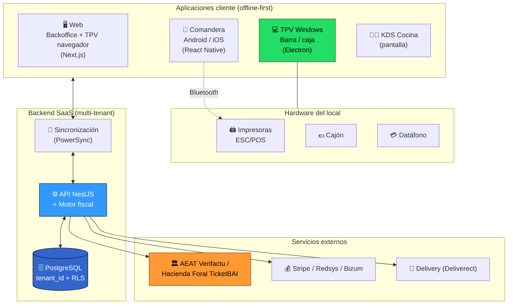

# Plataforma TPV para Hostelería — Documentación del Proyecto

> **Proyecto:** Sistema TPV (Terminal Punto de Venta) integral para bares y restaurantes.
> **Alcance:** Web (backoffice + TPV en navegador) · App de escritorio Windows (TPV de barra) · App Android e iOS (comanderas) · Backend SaaS multi‑tenant en la nube.
> **Mercado objetivo:** España (con especial atención a Canarias / IGIC, dado el origen del proyecto en La Palma) y, en una segunda fase, resto de la UE.
> **Marca:** **Gluuh** (marca paraguas, ya registrada). **Este producto: Gluuh TPV.** Familia con **Gluuh Campo** (análisis de facturas del campo).
> **Fecha de la documentación:** junio de 2026.

---

## 0. Cómo leer esta documentación

Esta carpeta es el **dossier completo** del proyecto: investigación de mercado, decisiones de producto, arquitectura técnica, cumplimiento legal, hardware, pagos y plan de ejecución. Está pensada para que un equipo (técnico, de negocio o un inversor) entienda **qué vamos a construir, por qué, con qué y en qué orden**.

Orden de lectura recomendado:

| # | Documento | Para quién | Qué responde |
|---|-----------|-----------|--------------|
| — | **[README.md](README.md)** (este) | Todos | Resumen ejecutivo, decisiones clave, índice |
| 01 | [Investigación de mercado](01-investigacion-mercado.md) | Negocio / Producto | ¿Quién compite, a qué precio y qué falla? |
| 02 | [Visión y posicionamiento](02-vision-y-posicionamiento.md) | Negocio / Producto | ¿Por qué vamos a ganar? Propuesta de valor |
| 03 | [Requisitos funcionales](03-requisitos-funcionales.md) | Producto / Desarrollo | ¿Qué hace exactamente el sistema? Módulos |
| 04 | [Arquitectura técnica](04-arquitectura-tecnica.md) | Desarrollo | ¿Cómo encaja todo? Diagramas, offline‑first |
| 05 | [Stack tecnológico](05-stack-tecnologico.md) | Desarrollo | ¿Con qué lo construimos y por qué? |
| 06 | [Base de datos y sincronización](06-base-de-datos-y-sincronizacion.md) | Desarrollo | Modelo de datos, multi‑tenant, sync offline |
| 07 | [Facturación y cumplimiento legal](07-facturacion-y-cumplimiento-legal.md) | Desarrollo / Legal | Verifactu, TicketBAI, IVA/IGIC, tickets |
| 08 | [Pasarelas de pago](08-pasarelas-de-pago.md) | Desarrollo / Negocio | Redsys, Stripe, Bizum, modelo plataforma |
| 09 | [Hardware](09-hardware.md) | Operaciones / Ventas | Terminales, impresoras, kits y precios |
| 10 | [Comanderas, KDS e impresión](10-comanderas-kds-e-impresion.md) | Desarrollo | App de camarero, pantallas de cocina, ESC/POS |
| 11 | [Modelo de negocio y precios](11-modelo-de-negocio-y-precios.md) | Negocio | Planes, tarifas, go‑to‑market, unit economics |
| 12 | [Seguridad y RGPD](12-seguridad-y-rgpd.md) | Desarrollo / Legal | Protección de datos, PCI, hardening |
| 13 | [Roadmap, MVP y equipo](13-roadmap-mvp-y-equipo.md) | Dirección | Fases, plazos, equipo y presupuesto |
| 14 | [Pantallas: kiosko, KDS, display, ofertas](14-pantallas-cliente-kiosko-y-kds.md) | Producto / Desarrollo | Autopedido estilo fast-food, cocina, estado del pedido, cartelería |
| 15 | [Cuentas y servicios](15-cuentas-y-servicios.md) | Dirección / Operaciones | Altas necesarias (dominio, GitHub, Supabase, Stripe, AEAT, stores…) |

---

## 1. Resumen ejecutivo

### 1.1 La oportunidad

El mercado de TPV de hostelería está **partido en dos** y deja un hueco claro en medio:

- Los **gigantes internacionales** (Toast, Square, Lightspeed, Clover, Revel…) son potentes pero **caros, con contratos de permanencia abusivos (hasta 3–4 años y penalizaciones de miles de euros), lock‑in de hardware y pasarela, y NO resuelven el cumplimiento fiscal español** (Verifactu / TicketBAI). Están diseñados para EE. UU.
- Los **TPV españoles** (Glop, ICG/HioPOS, Revo, Last.app, Camarero10, Ágora, Numier…) sí cumplen la normativa, pero arrastran tres quejas transversales y repetidas en las reseñas:
  1. **Caídas cuando falla internet** (los puros en nube dejan la caja parada).
  2. **Soporte deficiente** (lento, por distribuidor, sin atención en horario de hostelería).
  3. **Precios opacos** («consultar precio», cuotas ocultas tras la «prueba gratis», altas de 500 €).

> **El reloj que manda:** la AEAT obliga a que **todo software de facturación comercializado en España esté adaptado a Verifactu desde el 29 de julio de 2025** (obligación del fabricante, ya vigente). El uso obligatorio para negocios llega el **1 de enero de 2027 (sociedades)** y **1 de julio de 2027 (autónomos)**. Esto crea una **ola de renovación de TPV en 2026‑2027**: nacer 100 % conforme es, a la vez, requisito de entrada y la mayor oportunidad comercial.

### 1.2 Nuestra propuesta (en una frase)

> **Un TPV de hostelería vertical y «compliance‑first» para España, sin permanencia, con precios públicos, modo offline real (local‑first), soporte humano en español y hardware reutilizable — disponible en web, Windows, Android e iOS con una sola plataforma.**

Atacamos los tres dolores del mercado español (offline, soporte, transparencia), cumplimos la fiscalidad que los americanos ignoran, y ofrecemos la profundidad de restaurante de los líderes (mesas, comandas, KDS, división de cuenta, delivery) a un precio justo y honesto.

### 1.3 Las cinco decisiones clave del proyecto

| # | Decisión | Elección | Por qué |
|---|----------|----------|---------|
| 1 | **Stack de cliente** | Monorepo **TypeScript**: Next.js (web) + **Electron** (Windows) + **React Native/Expo** (móvil) | Máxima reutilización de código y lógica de negocio entre las 4 plataformas con un solo lenguaje y equipo |
| 2 | **Backend + datos** | **Supabase** (PostgreSQL multi‑tenant `tenant_id` + RLS, Auth, Realtime) + mini‑servicio fiscal | Backend gestionado, multi‑tenant simple y seguro, tiempo real para KDS/pantallas |
| 3 | **Offline‑first** | **PowerSync** (Postgres ↔ SQLite local, bidireccional) | Es *el* punto donde mueren los proyectos de TPV; PowerSync está hecho para «POS sin internet» |
| 4 | **Fiscalidad** | Motor **Verifactu + TicketBAI + IGIC/IVA** en el backend desde el día 1 | Es requisito legal y nuestro mayor diferenciador; no se puede añadir «después» |
| 5 | **Pagos** | **Stripe** (Terminal + Tap to Pay + Connect + QR) como núcleo, **Redsys/Bizum** en paralelo | Time‑to‑market y modelo plataforma con Stripe; comisión mínima y confianza local con Redsys |

### 1.4 Posicionamiento de precio (propuesta inicial)

Modelo **transparente, sin permanencia y sin alta** (lo contrario al mercado), con un plan de entrada accesible y monetización combinada de **suscripción + comisión de pago opcional**:

| Plan | Precio orientativo | Para quién |
|------|--------------------|-----------|
| **Free / Básico** | 0 € (cobramos un pequeño % solo si usan nuestra pasarela) | Micro‑bar, food truck, autónomo |
| **Pro** | ~39–49 €/mes por local | Bar / restaurante independiente |
| **Avanzado** | ~79–99 €/mes por local | Restaurante grande, multi‑zona, delivery |
| **Cadena** | a medida | Grupos y multi‑local |

Detalle completo y *unit economics* en **[11 — Modelo de negocio y precios](11-modelo-de-negocio-y-precios.md)**.

### 1.5 Plan de ejecución (resumen)

- **MVP (4–6 meses):** backoffice + TPV de escritorio (cobro, impresión, offline) + 1 comandera + sync + multi‑tenant + **Verifactu básico**. Equipo mínimo: 1 senior full‑stack TS + 1 mid + apoyo puntual de hardware/fiscal.
- **v1 comercial (+3–5 meses):** KDS, informes, gestión completa de carta/turnos, **TicketBAI**, datáfono real, pulido offline, app comandera iOS/Android pulida.
- **Escala:** multi‑local avanzado, analítica/IA, integraciones (delivery vía Deliverect, reservas), migración a infraestructura AWS.

Detalle, plazos y presupuesto en **[13 — Roadmap, MVP y equipo](13-roadmap-mvp-y-equipo.md)**.

---

## 2. Mapa de la solución (visión de una ojeada)

---

## 3. Marca: Gluuh (paraguas) y familia de productos

**Gluuh** es la **marca paraguas** (dominio `gluuh.com`, correo y redes **ya registrados**). Los productos se nombran como familia:

| Producto | Qué es | Estado |
|----------|--------|--------|
| **Gluuh Campo** | Análisis de facturas del campo | Existente |
| **Gluuh TPV** | Este proyecto: TPV de hostelería | En desarrollo |

En el código, el scope de paquetes es **`@gluuh/*`** y los identificadores **`com.gluuh.tpv`** / **`com.gluuh.comandera`**. Dominio sugerido para el TPV: **`tpv.gluuh.com`** (subdominio del dominio que ya tienes — sin coste de dominio nuevo). Cuentas a crear/reutilizar en **[15 — Cuentas y servicios](15-cuentas-y-servicios.md)**.

---

## 4. Glosario rápido

| Término | Significado |
|---------|-------------|
| **TPV** | Terminal Punto de Venta (POS en inglés) |
| **Comandera** | Dispositivo móvil del camarero para tomar pedidos en mesa |
| **KDS** | *Kitchen Display System* — pantalla de cocina que sustituye al papel |
| **Verifactu** | Sistema antifraude de la AEAT para software de facturación (RD 1007/2023) |
| **TicketBAI** | Equivalente foral del País Vasco (Álava, Gipuzkoa, Bizkaia) |
| **IGIC** | Impuesto General Indirecto Canario (sustituye al IVA en Canarias) |
| **ESC/POS** | Lenguaje estándar de comandos para impresoras de tickets |
| **Offline‑first / local‑first** | Arquitectura donde la app funciona sin internet y sincroniza al reconectar |
| **Multi‑tenant** | Una sola instalación del software sirve a muchos restaurantes aislados entre sí |
| **SaaS** | *Software as a Service* — software por suscripción en la nube |
| **SCA / PSD2** | Autenticación reforzada de pagos exigida por la normativa europea |

---

## 5. Estado de la documentación

| Documento | Estado |
|-----------|--------|
| 01 – 13 | ✅ Redactados (investigación de mercado + decisiones técnicas y de negocio) |
| Diseño UI/UX (wireframes) | ⏳ Pendiente (fase de diseño, ver roadmap) |
| Esquema SQL detallado / OpenAPI | ⏳ Pendiente (fase de arranque técnico) |
| Especificación XSD Verifactu final | ⚠️ Reconfirmar contra el portal AEAT antes de cerrar desarrollo |

> Toda la investigación está fechada en **junio de 2026** con fuentes citadas en cada documento. Las cifras de precios de competidores y comisiones son orientativas y deben reconfirmarse antes de cualquier decisión contractual.
