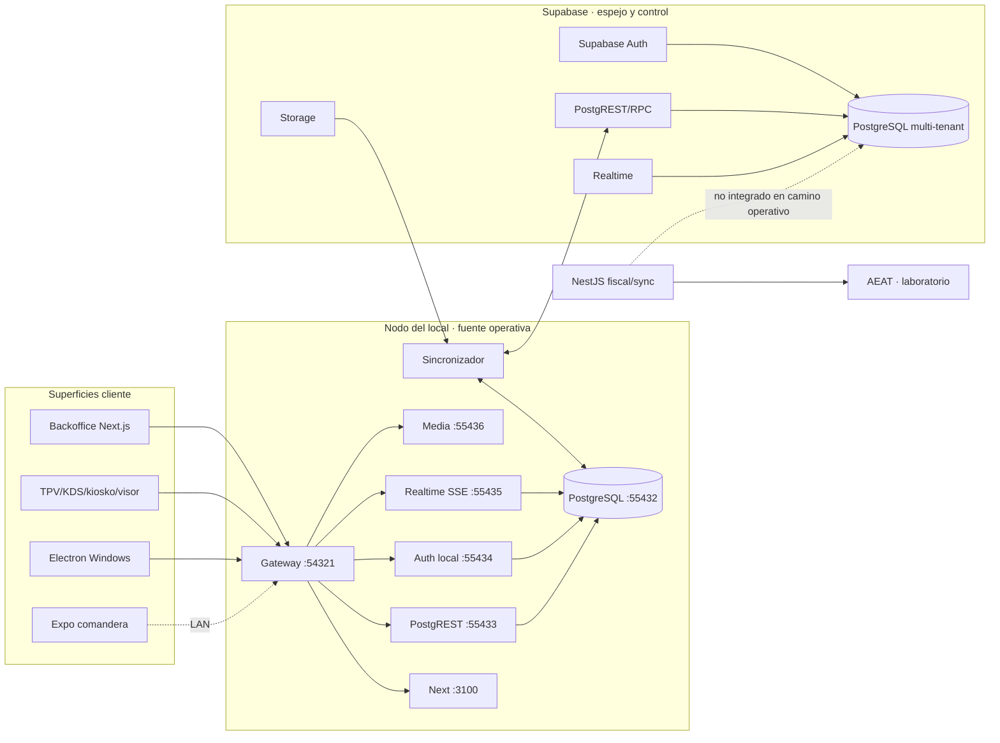
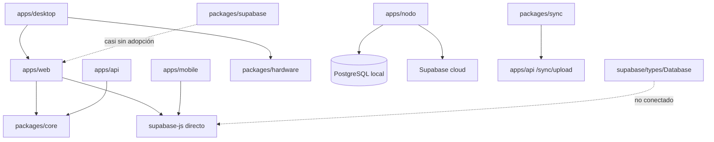
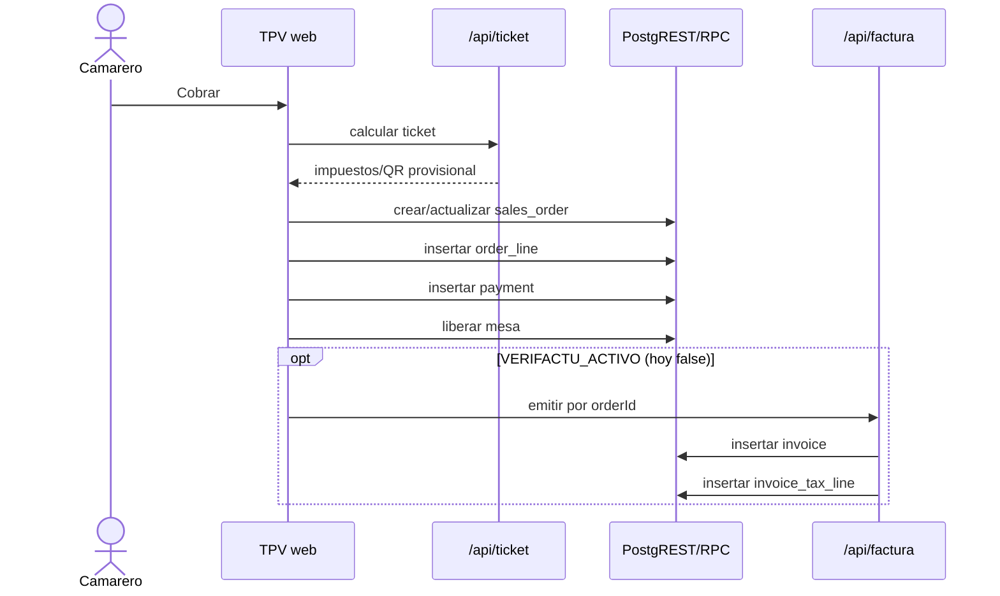

# 01 — Arquitectura actual

## Inventario tecnológico

| Capa | Tecnología observada | Versión/contrato | Estado |
|---|---|---|---|
| Monorepo | pnpm + Turborepo | pnpm 9.12, Turbo 2.9 | VC |
| Lenguaje | TypeScript ESM | TS 6, `strict`, `noUncheckedIndexedAccess` | VC |
| Web | Next.js App Router + React | Next 16.2, React 19.2, Tailwind 4 | VC |
| Estado UI | React state/context + Zustand | Zustand 5.0 | VC |
| Datos cloud | Supabase JS | 2.108; Auth, PostgREST, Realtime, Storage | VC |
| API | NestJS | 11.1 | VC |
| Núcleo fiscal | `@gluuh/core` | IVA/IGIC/IPSI, VERIFACTU, QR, XML | VC/VT |
| Escritorio | Electron | 42.4; bridge IPC y hardware | VC |
| Móvil | Expo/React Native | esqueleto funcional parcial | VC |
| Nodo | Node.js + PostgreSQL/PostgREST + servicios propios | puertos 55432–55436 y gateway 54321 | VC/VG |
| Pruebas | Vitest + scripts de nodo | 91 unitarias automáticas; integración de nodo manual | VT/VC |
| CI | GitHub Actions Ubuntu | lint, typecheck, test, build | VC |
| Despliegue web | OpenNext/Cloudflare | scripts y configuración versionados | VC |

El contrato de runtime mínimo es Node 20, pero varios paquetes compilan contra `@types/node` 25. Esto es deuda de compatibilidad: el compilador podría aceptar APIs no disponibles en el runtime mínimo.

## Topología actual

## Mapa de módulos y responsabilidades

| Módulo | Responsabilidad real | Dependencias principales | Observación |
|---|---|---|---|
| `packages/core` | Dominio y fiscalidad compartida | ninguna app | Es el límite más sano del sistema. |
| `apps/web/app/(panel)` | Backoffice | Supabase directo, UI, permisos cliente | Mayoritariamente Client Components. |
| `apps/web/app/tpv` | Venta, mesas, cobro y orquestación | Supabase, core, impresión, Realtime | `page.tsx` supera 3.000 líneas y mezcla presentación/casos de uso. |
| `apps/web/app/api` | BFF para factura, ticket, admin y dispositivos | Supabase caller/service, core | Autorización repetida por handler. |
| `apps/api` | API Nest fiscal y stub de sync | core, certificado AEAT | Protegida por token global; no está en el camino principal del TPV. |
| `apps/nodo` | Runtime local, auth, sync, media, gateway, updates | PostgreSQL local, Supabase cloud | Crítico y fuera del workspace/CI de tests. |
| `apps/desktop` | Shell Electron y hardware | `packages/hardware`, web del nodo | Renderer con bridge amplio. |
| `apps/mobile` | Comandera | Supabase directo | Menor madurez y cobertura. |
| `packages/hardware` | ESC/POS y contratos hardware | Node | Pequeño y reutilizable. |
| `packages/supabase` | Factoría genérica Supabase | `supabase-js` | No usa tipos generados. |
| `packages/sync` | Esqueleto PowerSync/SQLite | PowerSync, `/sync/upload` | Segunda arquitectura offline sin consumidores. |
| `packages/api-client`, `packages/ui` | Compartidos | varios | Typecheck aún es placeholder. |

## Dependencias y límites actuales

No se detectó una dependencia circular demostrada. El problema dominante es el contrario: varios límites compartidos existen pero no son el camino canónico, por lo que las apps acceden directamente a Supabase y duplican autorización, tipos y transacciones.

## Rutas y navegación

- **Públicas:** login, recuperación/cambio de contraseña, contacto, conexión/emparejado y activación.
- **Privadas de tenant:** route group `(panel)` y superficies operativas (`/tpv`, KDS, cocina, kiosko, pantalla, visor).
- **Administración de plataforma:** `/admin`, limitada por host en layout servidor y por `es_admin_plataforma` en las rutas sensibles.
- **API/BFF:** `/api/ticket`, `/api/factura`, `/api/verifactu/*`, `/api/dispositivos/*`, `/api/admin/*`.

No existen `loading.tsx`, `error.tsx`, `global-error.tsx`, `not-found.tsx`, `forbidden.tsx` ni `unauthorized.tsx` en `apps/web`. La carga y el error se gestionan de forma ad hoc. El layout del panel no monta sus hijos hasta resolver sesión/tenant/usuario en el navegador, creando un waterfall obligatorio.

## Flujos críticos actuales

### Venta y cobro

El flujo tiene compensaciones parciales, pero no una única frontera transaccional. Esa es la causa común de varios riesgos de integridad.

### Jornada/caja

Una venta recibe `jornada_id` por trigger. `jornada_abierta(location)` crea/reutiliza la jornada y `cerrar_jornada(id,...)` congela el Z. El diseño funcional es correcto, pero ambas RPC son `SECURITY DEFINER` sin comprobación de tenant, por lo que el límite de seguridad invalida hoy el flujo.

## Configuración y entornos

- El nodo inyecta `window.__GLUUH__` en el HTML para que una build sirva a todos los bares.
- `supabaseServidor` decide correctamente entre caller/service y cloud/nodo para las rutas que lo usan.
- `.env` no se versiona; las plantillas existen, pero `apps/api/.env.example` no documenta `GLUUH_API_TOKEN` ni `CORS_ORIGINS`.
- `README.md`, `apps/web/DEPLOY.md`, `apps/desktop/README.md` y `packages/sync` describen partes ya sustituidas o no canónicas (`proxy.ts`, puerto 3100, `schema.sql`, PowerSync activo).
