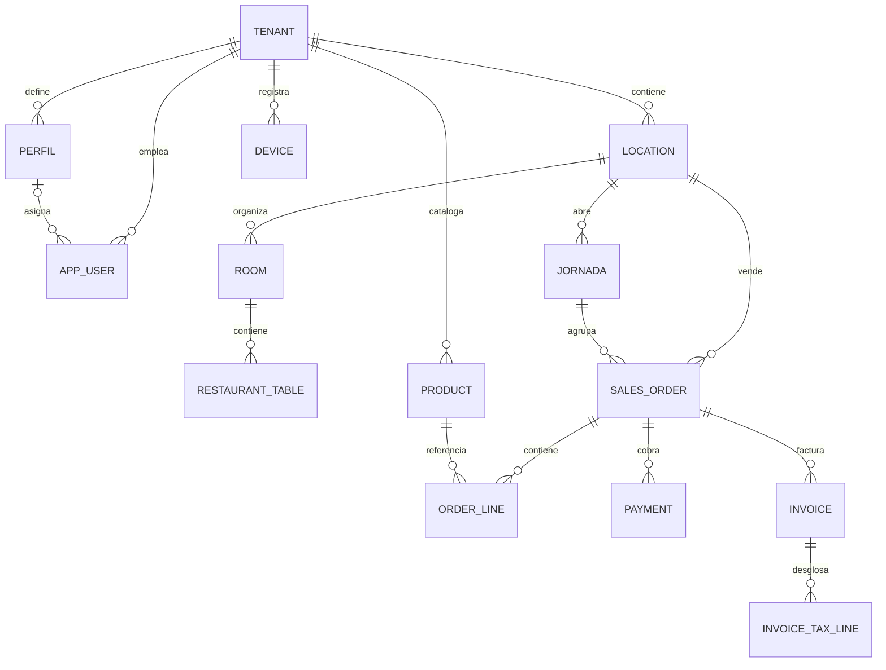
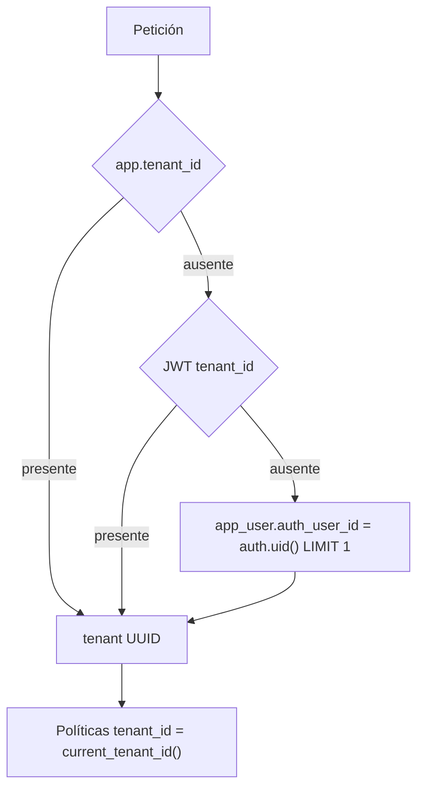
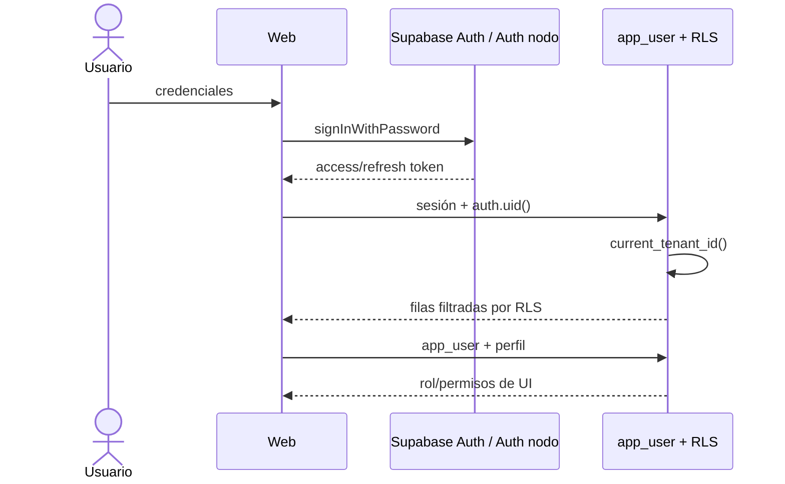

# 02 — Supabase, modelo de datos y multi-tenancy

## Fuente y limitaciones

El inventario se obtuvo de las 110 migraciones y de `supabase/types/database.types.ts`, generado el 17-07-2026. Este último expone `public` con **82 tablas, 43 funciones, 0 vistas y 0 enums**, sobre PostgREST 14.5. No se consultó el catálogo vivo ni datos reales; tamaños, cardinalidades, owners, grants efectivos, bloat e índices no usados son **NV**.

El fichero está en UTF-16 LE y ningún cliente importa `Database`; por tanto es una referencia legible, pero hoy no constituye un contrato compilado.

## Inventario funcional de tablas

| Clasificación | Tablas |
|---|---|
| Global/plataforma | `allergen`, `tax_rate`, `tarifa_plataforma`, `nodo_release`, `platform_admin`, `contact_request` |
| Tenant/empresa | `tenant`, `tenant_branding`, `tenant_module`, `licencia`, `pago_gluuh`, `setting` |
| Identidad/RBAC/dispositivo | `app_user`, `perfil`, `device` |
| Sucursal/estructura | `location`, `room`, `restaurant_table`, `sales_center`, `grupo_punto_venta`, `punto_venta`, `warehouse`, `shift` |
| Catálogo/producto | `product`, `family`, `category`, `grupo_mayor`, `product_category`, `product_format`, `product_price`, `etiqueta_producto`, `product_etiqueta`, `alergeno`, `product_allergen`, `ingredient`, `recipe_item`, `unit_of_measure` |
| Segmentación de catálogo | `family_grupo_pv`, `category_grupo_pv`, `category_sales_center`, `category_horario`, `periodo_servicio`, `tipo_preparacion`, `nota_preparacion` |
| Menús/modificadores/promoción | `menu`, `menu_group`, `menu_choice`, `modifier`, `modifier_group`, `modifier_group_asignacion`, `offer`, `promocion`, `discount`, `tarifa` |
| Cliente/reserva/canal | `customer`, `customer_type`, `reservation`, `online_order` |
| Venta/cocina | `sales_order`, `order_line`, `order_event`, `cancel_reason` |
| Pago/caja/jornada | `payment`, `payment_method`, `cash_session`, `cash_move`, `jornada` |
| Fiscal | `invoice`, `invoice_series`, `invoice_tax_line`, `tax_line`, `verifactu_record`, `ticketbai_record` |
| Impresión/layout | `printer`, `print_route`, `print_job`, `plantilla_ticket`, `plantilla_comanda`, `plantilla_etiqueta`, `plano_elemento` |
| Inventario/proveedor | `stock_move`, `supplier` |

75 de 82 tablas contienen `tenant_id`. Las siete sin él son `allergen`, `contact_request`, `nodo_release`, `platform_admin`, `tarifa_plataforma`, `tax_rate` y `tenant`; su ausencia es coherente con su papel global o raíz. `alergeno` sí es tenant-specific, mientras `allergen` es el catálogo global heredado.

## Entidades SaaS

| Concepto | Entidad actual | Observación |
|---|---|---|
| Empresa/tenant | `tenant` | Unidad de aislamiento. No hay selector multiempresa por usuario. |
| Sucursal/local | `location` | Pertenece a tenant; algunas pantallas toman el primer local. |
| Almacén | `warehouse` | Tenant y relación operativa con stock. |
| Caja/terminal | `punto_venta` + `device` | Conceptos separados; la asociación no es uniforme. |
| Usuario/empleado | `app_user` | Relación a `auth.users` por `auth_user_id`; un usuario debería pertenecer a un tenant. |
| Perfil | `perfil` | JSON de permisos; nullable en `app_user`. |
| Cliente | `customer` | Específico del tenant. |
| Sesión de caja | `cash_session` | Coexiste con `jornada`, que representa el día operativo/fiscal. |

## Resolución del tenant

La estrategia de **tablas compartidas con `tenant_id` + RLS** sigue siendo adecuada: menor coste operativo y migraciones centralizadas. No se recomienda una base o esquema por cliente ahora. El aislamiento debe reforzarse con:

1. Unicidad obligatoria de `app_user.auth_user_id`.
2. FK compuestas `(tenant_id, parent_id)` en agregados críticos.
3. Toda RPC definer validando tenant/rol internamente y sin `EXECUTE PUBLIC`.
4. Escrituras monetarias/fiscales exclusivamente por casos de uso server-side.

## Flujo de autenticación

- Cloud usa Supabase Auth; el nodo implementa un dialecto compatible y emite JWT locales.
- El navegador persiste sesiones en `localStorage` mediante `supabase-js`.
- La credencial de dispositivo firmada se guarda también en `localStorage`, pero varias pantallas usan el `device_id` editable y no verifican el JWT.
- MFA, reautenticación sensible, revocación de dispositivo y control de sesiones simultáneas no están implementados de forma demostrable.
- El endpoint público de canje tiene validación de código y rate limit en memoria; no es compartido entre instancias.

## Modelo de roles y matriz RBAC

Roles observados: `PROPIETARIO`, `ENCARGADO`, `CAMARERO`, `COCINA`, `REPARTIDOR`, `ADMIN_PLATAFORMA`. Los perfiles añaden un mapa JSON de permisos. Actualmente “clave ausente” significa permitido.

| Capacidad | Propietario | Encargado | Camarero | Cocina | Admin plataforma | Aplicación real |
|---|---:|---:|---:|---:|---:|---|
| Operar TPV/mesas | Sí | Sí | Sí | No | No | UI + RLS tenant |
| Cobrar | Sí | según perfil | según perfil | No | No | Principalmente UI; escrituras directas |
| Cerrar jornada | Sí | previsto | No | No | No | RPC no valida rol/tenant |
| Editar catálogo | Sí | según perfil | No previsto | No | No | UI; RLS 0072 depende de `operario_permite` |
| Gestionar usuarios/perfiles | Sí | según perfil | No | No | No | RLS 0071 fail-open |
| Administrar empresas/licencias | No | No | No | No | Sí | Host + RPC `es_admin_plataforma` + rutas server |
| Enviar AEAT | futuro | futuro | No | No | soporte | API con token global, no tenant-scoped |

**Conclusión:** existe catálogo RBAC, pero aún no una frontera de autorización consistente. Ocultar menú no es autorización; los permisos sensibles deben evaluarse en RPC/BFF y ser fail-closed.

## Matriz de aislamiento multi-tenant

| Superficie | Mecanismo actual | Estado | Riesgo |
|---|---|---|---|
| Tablas tenant | `tenant_id` + RLS | Parcialmente robusto | Medio: faltan FK compuestas. |
| Usuario → tenant | `current_tenant_id()` por claim/lookup | Débil | Alto si hay `auth_user_id` duplicado. |
| Panel | sesión + RLS + permisos UI | Débil | Alto por fallback a propietario/permisos abiertos. |
| RPC normales | RLS del invocador | Variable | Revisar firma a firma. |
| RPC `SECURITY DEFINER` | validación manual | Inconsistente | Crítico en jornada; alto en heartbeat. |
| Service role/BFF | validación previa de caller | Buena en admin revisado | Blast radius alto ante omisión. |
| Realtime cloud | publicación + RLS de suscriptor | INF | Requiere prueba cruzada viva. |
| Nodo local | una copia por tenant | Bueno por topología | Credenciales y LAN amplían superficie. |
| Sync nodo→cloud | sesión normal del bar + RLS | Bueno como principio | Cuenta de servicio y cursores pendientes. |
| Storage/media local | ruta segura solo en servidor GET/POST | Débil | POST sin auth/límite; downloader inseguro. |

## Auditoría RLS y privilegios

### Fortalezas verificadas

- RLS está extendida al modelo multiempresa y no se observó `auth.role()` obsoleto.
- Los catálogos globales `tax_rate`/`allergen` tienen lectura global intencionada.
- Las funciones admin revisadas comprueban `es_admin_plataforma` y revocan ejecución pública.
- La migración 0062 añadió índices para FK existentes entonces.
- Realtime se publica selectivamente para ventas, catálogo, impresión y mesas.

### Debilidades verificadas

1. `jornada_abierta` y `cerrar_jornada` son definers, no validan `current_tenant_id()` y no revocan `PUBLIC`.
2. `device_heartbeat` actualiza por UUID, concede a `anon` y no comprueba identidad/tenant.
3. `operario_permite` termina en `coalesce(..., true)`; un empleado sin perfil queda autorizado.
4. `authenticated` tiene CRUD general y el TPV escribe precios/impuestos/pagos desde navegador.
5. Migraciones posteriores a 0062 introducen FK sin repetir el advisor; índices tenant-first no siempre sirven al lookup de la FK.
6. Las FK por ID no obligan a que padre e hijo compartan tenant.

## Contraste migraciones ↔ tipos ↔ código

| Contraste | Evidencia | Clasificación |
|---|---|---|
| `0105` añade `device.usuario`, `device.clave_hash`, `fijar_clave_dispositivo`, `verificar_clave_dispositivo` | Están en SQL y se invocan en web/nodo, pero no aparecen en tipos recién generados | VC + INF: probable migración omitida en cloud |
| `0106`–`0110` | Sus RPC/columnas sí aparecen en tipos | VC |
| Tipos generados | Ningún cliente usa `Database`; ESLint los ve binarios | VC/VT |
| `apps/api/db/schema.sql` | Sigue citado por README/PowerSync, pero no es canónico | VC |
| Tabla `media` | Los usos `.from("media")` aparentes corresponden a bucket Storage, no tabla | Falso positivo descartado |

## Estrategia recomendada de tenant

Mantener **shared schema + `tenant_id` + RLS**, con una copia operativa por nodo/local. Frente a esquema/base por cliente:

- **Ventajas:** menor coste, upgrades homogéneos, administración central, analítica y backup global sencillos.
- **Desventajas:** una RPC definer incorrecta puede cruzar tenants; restaurar un tenant exige tooling lógico.
- **Mitigación:** constraints compuestos, suite adversarial de dos tenants, restore por tenant probado, service accounts de mínimo privilegio y revisión automática de grants/RLS por migración.
