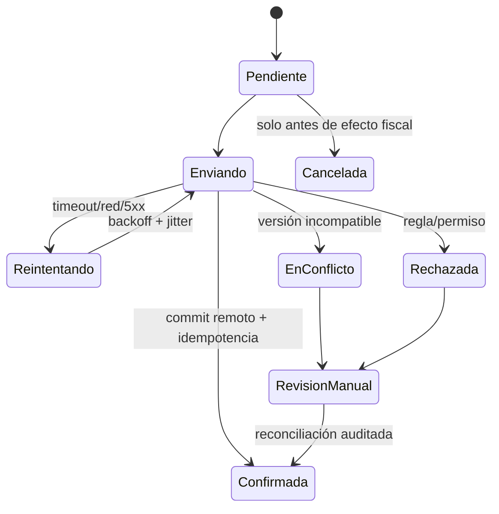

# 04 — Rendimiento, offline, Realtime, calidad y operación

## Auditoría de consultas y PostgreSQL

### Patrones positivos

- Operaciones delicadas existentes (`guardar_cuenta`, dividir/traspasar, jornada) usan locks o transacciones en PostgreSQL.
- RLS mantiene el filtro tenant en base de datos, no solo en frontend.
- La migración 0062 cubrió FK existentes; hay índices tenant-first en las tablas operativas principales.
- El motor fiscal compara clases/tipos TypeScript con SQL mediante test.

### Prioridades de consulta

| Patrón | Evidencia/estado | Acción |
|---|---|---|
| N+1 de modificadores | Ficha producto hace `1 + grupos`; copia secuencial | `.in(...)` para lectura y RPC de clonación. |
| Agregación de dashboard | descarga ventas del día y suma en navegador | RPC set-based por tenant/local/jornada. |
| `admin_uso_empresas` | cuatro subconsultas correlacionadas por tenant | preagregar y medir `EXPLAIN`; índice `(tenant_id, created_at)` si procede. |
| FK posteriores a 0062 | índice compuesto no siempre empieza por FK | advisor final y gate CI. |
| Número de pedido | `max()+1` sin lock/unique | contador atómico + unique local/número. |
| Queries sin tipo | casts y fallbacks silenciosos | clientes `Database` y contratos RPC. |

No se puede afirmar qué índice es “lento” o “no usado” sin `pg_stat`, cardinalidad y `EXPLAIN (ANALYZE, BUFFERS)` en un entorno seguro. La recomendación es medir primero y aplicar índices solo con hipótesis verificable.

## Rendimiento frontend

### Línea base estática

- El layout del panel espera hidratación, `getSession`, tenant y usuario antes de montar la página; después el dashboard inicia nuevas rondas.
- `tpv/page.tsx` y `PlanoSalas.tsx` superan conjuntamente 4.800 líneas y concentran estado, I/O y JSX.
- Ya existen mejoras valiosas: carga TPV paralela, índice O(1) del catálogo, memoización selectiva, imágenes reducidas/lazy y code splitting documentado.
- No hay medición versionada de Web Vitals, presupuesto de bundle o rendimiento en hardware objetivo.

### Objetivos medibles propuestos

| Métrica | Línea base | Objetivo inicial |
|---|---|---|
| LCP panel/TPV p75 | NV | < 2,5 s en terminal objetivo/LAN; < 4 s en 4G cloud |
| INP p75 | NV | < 200 ms; tecla/producto visible < 100 ms en TPV |
| Errores de carga | sin métrica | < 1% sesiones; estado de error explícito |
| Peticiones hasta dashboard útil | múltiples fases | bootstrap + una ronda paralela, sin waterfall obligatorio |
| Bundle por ruta | NV | presupuesto por ruta y alerta de +10% |
| Listados | no virtualizados globalmente | virtualizar cuando medición supere 200 filas visibles |

No se recomienda convertir indiscriminadamente todo a RSC: la build del nodo necesita configuración runtime inyectada. Debe existir un bootstrap server compatible con cloud/nodo o una API same-origin que preserve esa propiedad.

## Rendimiento backend

- Nest valida DTO de forma manual y tiene un guard global con comparación constante, pero usa un token global y el servicio fiscal recibe campos libres.
- `/fiscal/enviar` es síncrono y no persiste outbox/intentos/acuses.
- No se observan correlation IDs, timeouts uniformes, retry policy o rate limiting general.
- `/sync/upload` es stub y debe estar cerrado hasta ser real.
- `apps/api` no es hoy el backend operativo central: gran parte del negocio vive en Postgres/RPC y route handlers Next. La arquitectura objetivo debe reconocerlo, no forzar una migración masiva a Nest.

## Offline-first actual

La estrategia operativa vigente es **nodo PostgreSQL como fuente de verdad del bar** y nube como espejo/control. `packages/sync`/PowerSync es un spike separado y no debe considerarse activo.

### Garantías actuales y objetivo

| Dimensión | Actual | Objetivo |
|---|---|---|
| Operación sin internet | TPV contra nodo local | Mantener; readiness visible. |
| IDs | UUID/client_id en varias tablas | UUID en cliente + idempotency key obligatoria. |
| Reintentos | pases periódicos, upsert | backoff/jitter, estados y causa persistidos. |
| Ventas/fiscal | subida por tabla/marca temporal | outbox append-only, orden causal y confirmación remota. |
| Catálogo | last-write-wins por `updated_at` | cursor compuesto; conflictos visibles para campos sensibles. |
| Borrado | tres guards documentados | tombstone/evento, nunca inferencia por snapshot truncado. |
| Medios | cola local | auth, límite, hash, escritura atómica. |
| Recuperación | backups locales y cloud | restore probado y RPO/RTO definidos. |

### Política por clase de dato

- **Ventas, pagos, jornada y fiscal:** append-only o transiciones controladas; nunca last-write-wins. Idempotencia y orden causal.
- **Catálogo/precios:** edición bidireccional con versión; conflicto explícito si ambos lados cambiaron desde ancestro.
- **Configuración sensible/RBAC:** cloud/control o propietario autorizado; auditoría completa.
- **Telemetría/heartbeat:** sobrescritura monotónica y autenticada; pérdida de un evento es tolerable.

## Realtime

- Cloud publica ventas/pedidos, catálogo/impresión y mesas.
- El nodo emula Realtime mediante SSE y el gateway conserva streaming.
- `escucharCambios` limpia EventSource/canales/timers; no se confirmó el falso positivo de fugas por cleanup.
- Varias pantallas usan el evento como invalidación y recargan tablas completas; es robusto ante evento perdido, pero costoso.
- RLS de Realtime entre dos tenants y reconexión/eventos duplicados no se verificaron en vivo.

Estrategia objetivo: Realtime es **señal de invalidación**, no fuente durable de verdad. Toda carga debe poder reconstruirse desde DB; incluir versión/ID, coalescer catálogo/mesas y no coalescer trabajos de impresión. Añadir prueba de dos tenants y métricas de reconexión, lag y recargas.

## Pruebas y calidad

| Nivel | Estado actual | Brecha |
|---|---|---|
| Unitario fiscal/core | 44 tests, incluido vector AEAT | Mantener innegociable; añadir F1 integral. |
| Unitario web | 37 tests de funciones puras | No cubre workflows/rutas/componentes. |
| Unitario API | 10 tests de validación | No cubre auth, servicio, AEAT/outbox. |
| Integración PostgreSQL | scripts nodo manuales | No corre en CI; algunas usan conexión privilegiada. |
| RLS/multi-tenant | SELECT cruzado manual | Faltan DML, RPC definer, anon/auth/service y FK. |
| Offline/sync | pruebas reales documentadas | Faltan cursores > lote, cortes, replay y conflictos. |
| E2E | no automatizado | Journey camarero y recuperación de cobro. |
| Windows/instalador | manual | Falta job Windows/PS5.1 y máquina limpia. |
| Rendimiento | no existe baseline | Web Vitals, bundle, consultas y terminal modesto. |

Pirámide recomendada: muchas unidades puras; contratos de RPC/routes; integración DB de dos tenants; pocos journeys E2E de alto valor; pruebas reales de hardware/instalación como release gate.

## Observabilidad

Actual: `console`, logs de servicios, `/nodo/estado`, estado de sync en tablas, admin de uso y heartbeat. No hay esquema uniforme, correlation ID, trazas distribuidas, SLO o alertas demostrables.

Objetivo mínimo:

- Log JSON con `timestamp`, `level`, `service`, `version`, `tenant_id` pseudonimizado, `location_id`, `device_id`, `operation_id`, `correlation_id`, `event`, `error_code`; nunca tokens/PIN/NIF completo.
- Métricas: ventas/cobros parciales, factura pendiente, lag/outbox por tabla, último sync, cursores, errores auth/RLS, Realtime reconnect, cola impresión/media, disco, backups y restore age.
- Trazas solo en fronteras HTTP/RPC/sync/fiscal; sampling alto en errores.
- Health separado de diagnóstico; alertas por ausencia de heartbeat y no por heartbeat aislado.
- Auditoría append-only para rol/perfil, precio, anulaciones, cierre Z, factura, dispositivo y acciones de soporte.

SLO inicial propuesto: cobro local disponible 99,95% durante servicio; cero pérdida confirmada de venta/pago; sync cloud < 15 min p95 al recuperar internet; factura pendiente visible en < 1 min; restore trimestral exitoso.

## Riesgos de empezar por refactor estructural

1. Mover JSX/hooks antes de caracterizar cobro puede alterar memoria muscular y cierres sobre estado.
2. Migrar a RSC sin respetar `window.__GLUUH__` rompe nodo aunque cloud funcione.
3. Endurecer permisos sin backfill puede bloquear el servicio del bar.
4. Añadir constraints sin preflight puede fallar por datos históricos.
5. Cambiar sync sin cursor de recuperación puede volver invisibles filas.
6. Activar VERIFACTU antes de outbox/idempotencia convierte fallos recuperables en documentos fiscales inconsistentes.
