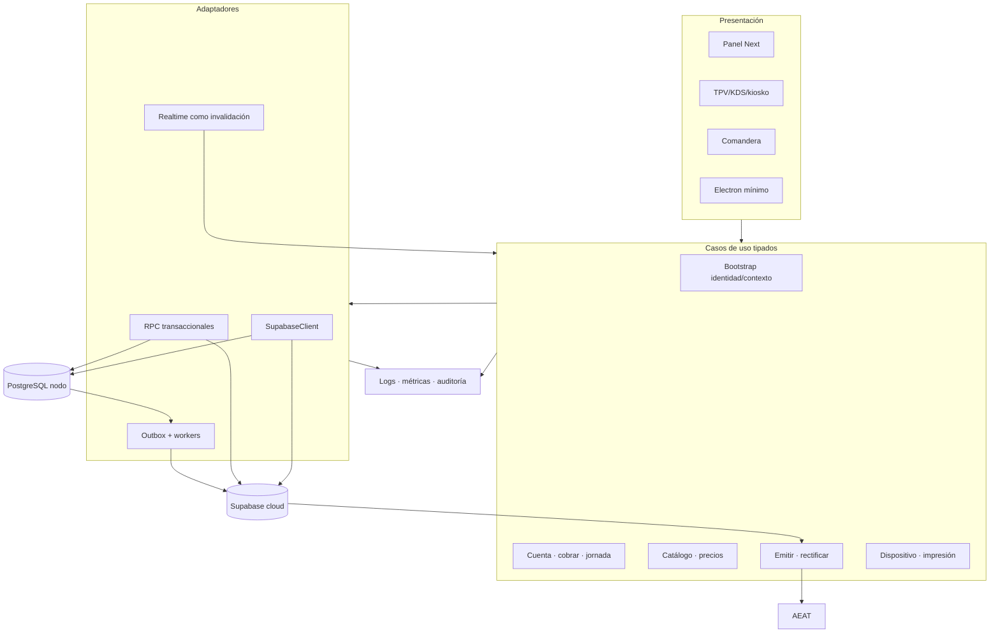

# 05 — Arquitectura objetivo

## Principios

1. PostgreSQL es la frontera de integridad; UI nunca decide dinero, impuesto, rol o tenant.
2. Nodo/local-first sigue siendo la fuente operativa del bar; la nube es espejo, control y envío fiscal.
3. Realtime despierta/invalidada; la base durable reconstruye el estado.
4. Ventas/fiscal usan transacciones, idempotencia y outbox; catálogo usa versiones/conflictos.
5. Tipos generados y contratos RPC son el lenguaje común entre capas.
6. Seguridad fail-closed, excepto una política offline mínima y explícita, nunca un fallback accidental.



## Decisiones arquitectónicas

### ADR-A — Multi-tenancy compartida reforzada

- **Problema/contexto:** el modelo compartido escala bien, pero definers/FK pueden cruzar tenants.
- **Decisión/justificación:** mantener `public` compartido con `tenant_id` + RLS; añadir FK compuestas, unicidad de identidad, suite adversarial y service accounts. Evita coste de una base por bar y preserva Supabase.
- **Alternativas:** esquema/base por tenant (mejor blast radius, peor operación/migración/analítica); híbrido solo para grandes cadenas (posible futuro).
- **Ventajas/desventajas:** bajo coste y una migración / exige disciplina absoluta en RPC y restore lógico.
- **Riesgos/consecuencias:** constraints pueden revelar datos incoherentes; se requiere preflight y migración por agregados.
- **Coste/complejidad/impacto:** L / alta / crítico en seguridad.
- **Dependencias/aceptación:** AUD-001/002, tipos y tests; cero DML/RPC cruzado en matriz de dos tenants y restore de un tenant ensayado.

### ADR-B — PostgreSQL transaccional para casos de uso monetarios

- **Problema/contexto:** PostgREST directo reparte una operación de negocio en varias llamadas.
- **Decisión/justificación:** `guardarCuenta`, `cobrarVenta`, `emitirFactura`, `cerrarJornada` y cambios sensibles serán comandos RPC/BFF tipados, transaccionales e idempotentes.
- **Alternativas:** saga/event sourcing total. Sagas son útiles entre cloud/AEAT, pero innecesarias dentro de una DB; event sourcing completo tiene coste excesivo ahora.
- **Ventajas/desventajas:** integridad y replay seguro / más lógica SQL y contratos versionados.
- **Riesgos/consecuencias:** RPC demasiado grandes; mitigar con módulos SQL, validaciones y tests de contrato.
- **Coste/complejidad/impacto:** L / alta / crítico.
- **Dependencias/aceptación:** tipos, RBAC y migraciones aditivas; fallos inyectados no dejan parciales y doble comando devuelve mismo resultado.

### ADR-C — Una sola arquitectura offline operativa

- **Problema/contexto:** nodo/Postgres real convive con un esqueleto PowerSync que descartaría cambios.
- **Decisión/justificación:** consolidar nodo/Postgres como solución v1; `packages/sync` queda experimental/inhabilitado hasta una ADR futura.
- **Alternativas:** PowerSync/SQLite (bueno para móvil, exige write-path/reglas/licencia/migración); cloud-only (no cumple continuidad).
- **Ventajas/desventajas:** aprovecha inversión y pruebas reales / operar siete servicios locales es más complejo.
- **Riesgos/consecuencias:** actualizador, backups y soporte del nodo se vuelven producto crítico.
- **Coste/complejidad/impacto:** M para consolidar, L para endurecer / alta / alto.
- **Dependencias/aceptación:** cursores, service account, restore, health y CI Windows; una venta offline sobrevive reinicio y converge una sola vez.

### ADR-D — Outbox fiscal cloud por tenant

- **Problema/contexto:** enviar AEAT síncrono desde payload libre produce estados desconocidos y usa token/certificado global.
- **Decisión/justificación:** la factura se persiste localmente con obligación fiscal; sync crea outbox cloud; worker tenant-scoped envía con idempotencia, acuse, reintento y auditoría.
- **Alternativas:** envío síncrono en cobro (simple, bloquea y deja incertidumbre); envío desde nodo (certificados distribuidos y difícil rotación).
- **Ventajas/desventajas:** durable, observable y secreto central / factura puede quedar pendiente y exige UX/operación.
- **Riesgos/consecuencias:** orden por serie/tenant y plazos regulatorios; alertas y cola priorizada.
- **Coste/complejidad/impacto:** L / alta / crítico fiscal.
- **Dependencias/aceptación:** AUD-003/004, certificados por tenant, endpoints AEAT reconfirmados; timeout/replay no duplica y todo pendiente es visible.

### ADR-E — Identidad unificada de usuario y dispositivo

- **Problema/contexto:** sesión de usuario y JWT de dispositivo coexisten; el segundo no gobierna decisiones.
- **Decisión/justificación:** gateway/BFF verifica ambos y produce `RequestContext {tenant, location, user, role, device, module, correlation}`; DB recibe claims mínimos y vuelve a validar tenant.
- **Alternativas:** solo usuario (mala trazabilidad de terminal); cuentas Auth por dispositivo (más ciclo operativo).
- **Ventajas/desventajas:** autorización/auditoría coherentes / migración transversal y rotación de credenciales.
- **Riesgos/consecuencias:** bloqueo offline por expiración; tokens locales renovables y período de gracia controlado.
- **Coste/complejidad/impacto:** L / alta / alto.
- **Dependencias/aceptación:** `0105`, gateway/auth nodo y RPC; localStorage manipulado no cambia contexto, revocación efectiva y heartbeat propio.

### ADR-F — Realtime como invalidación, no cola

- **Problema/contexto:** eventos pueden perderse/duplicarse y algunas pantallas recargan todo.
- **Decisión/justificación:** canales emiten ID/versión; consumidores coalescen y consultan estado durable; impresión/fiscal usan outbox, no Realtime.
- **Alternativas:** estado event-driven puro (más infraestructura); polling (simple, más latencia/carga).
- **Ventajas/desventajas:** recuperación natural / lectura adicional tras evento.
- **Riesgos/consecuencias:** tormenta de invalidaciones; debounce por dominio y métricas.
- **Coste/complejidad/impacto:** M / media / medio-alto.
- **Dependencias/aceptación:** contratos por canal; reconexión reconstruye estado y dos tenants no reciben/leen datos cruzados.

### ADR-G — Observabilidad y seguridad como contrato de plataforma

- **Problema/contexto:** logs ad hoc y diagnóstico excesivo no permiten SLO ni investigación segura.
- **Decisión/justificación:** evento estructurado común, audit log append-only, correlation ID, métricas de cola/fiscal/sync y health mínimo separado.
- **Alternativas:** proveedor APM completo desde el inicio (rápido, coste/lock-in); solo logs (insuficiente).
- **Ventajas/desventajas:** soporte y alertas accionables / coste de almacenamiento y disciplina de PII.
- **Riesgos/consecuencias:** registrar secretos; esquema allowlist y tests de redacción.
- **Coste/complejidad/impacto:** M / media / alto operativo.
- **Dependencias/aceptación:** contexto unificado; un cobro se sigue por correlation ID sin token/PIN/NIF completo y alertas detectan cola atascada.

## Estructura modular recomendada

No se propone mover todo de golpe. La estructura es un destino para extracciones por caso de uso:

```text
packages/
  core/                    # dominio/fiscal puro ya existente
  contracts/               # Database, DTO/RPC, errores, schemas runtime
  application/
    ventas/
    caja-jornada/
    catalogo/
    fiscal/
    dispositivos/
  observability/           # eventos, redacción, correlation
apps/web/
  app/                     # rutas/layouts delgados
  features/<dominio>/
    ui/ hooks/ queries/ commands/
apps/nodo/
  services/                # gateway, auth, realtime, media
  sync/                    # cursores/outbox/reconciliación
  update/                  # manifest, backup, migración, health
supabase/
  migrations/              # canónico
  tests/                   # matriz RLS/RPC y contratos
  types/                   # generado UTF-8, sin edición manual
```

### Reglas de dependencia

- Presentación → aplicación → contratos/adaptadores; nunca UI → SQL informal para dinero/rol.
- Un feature importa otro solo por su API pública, no por componentes internos.
- `packages/core` no depende de React, Supabase ni Node específico.
- Validación runtime en toda frontera HTTP/IPC/JSON; TypeScript no valida entradas.
- Ninguna función definer se publica sin `REVOKE`, check de identidad/tenant y test adversarial.
- Ninguna migración se considera entregada hasta regenerar tipos, pasar advisor y aplicar matriz DB.
- Feature flags de fiscal/sync deben fallar cerrados y expresar estado experimental.
